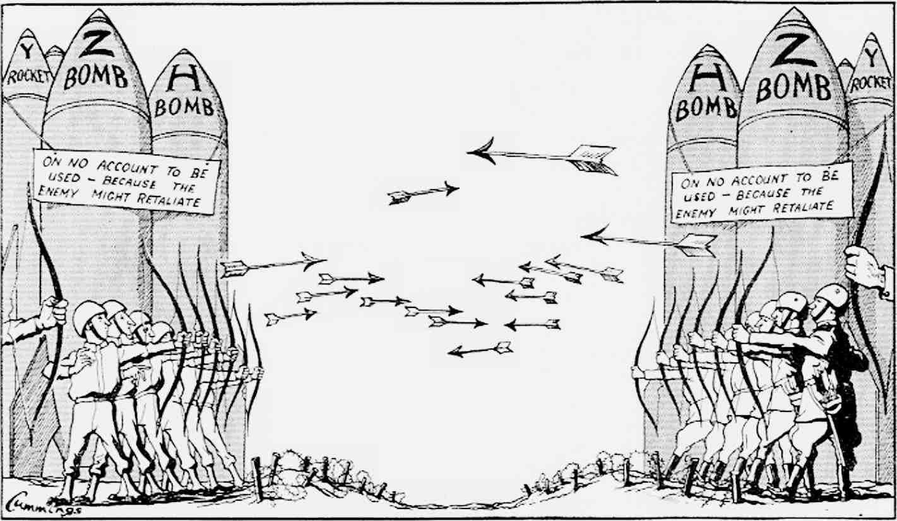
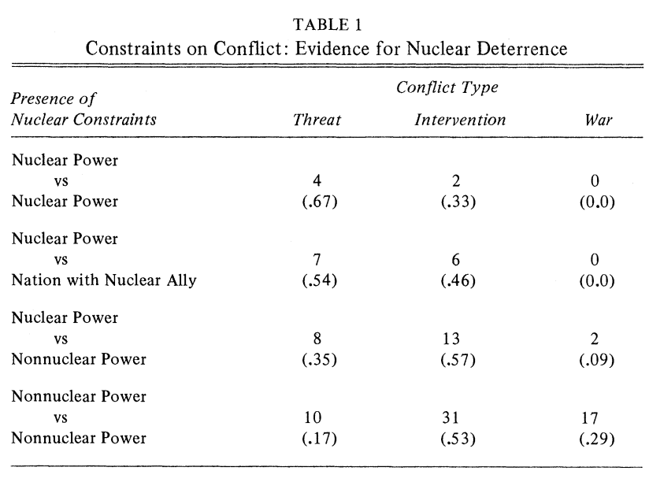
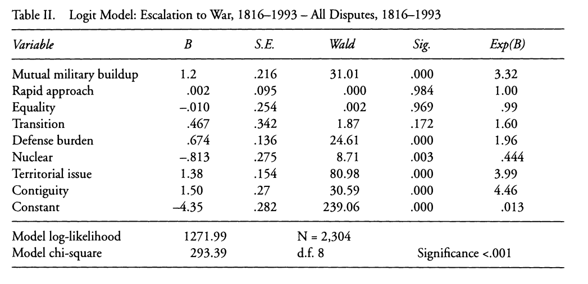
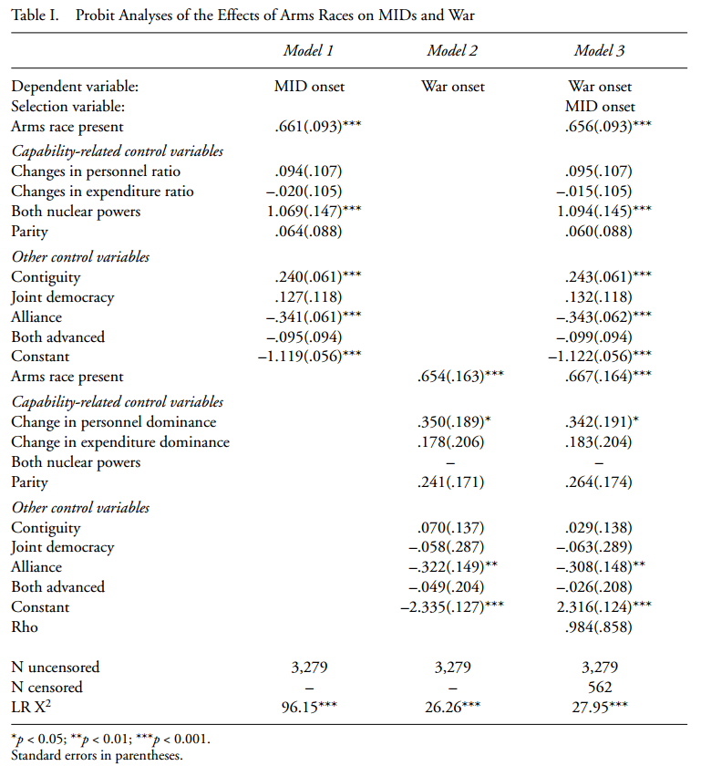

# Introduction
### Goal for Today

*Discuss the arms race and war relationship, among other hypotheses.*

# Arms Races and War
### Do Arms Races Lead to War?

### Arms Races and War

This was arguably the empirical debate of the 1970s/early 1980s.

- War-preparedness model (Vegetius)
- Spiral model

### Lewis Fry Richardson's Model

Richardson (1949, 1960) proposed an empirical test.

- *Argument:* states acquire arms as a function of 1) perceived threat and 2) "fatigue" in pursuing arms over other priorities.
- *Findings:* Fatigue depresses arms races while perceived threat accelerates them.
- *Conclusion:* If perceived threat exceeds fatigue, arms races spiral toward war.

### Limitations of Richardson's Model

However, Richardson's model suffered from several shortcomings.

- His **dependent variable** is just about changes in arms expenditures.
- Connection to war is not logically implied.
- Richardson, a meteorologist by trade, does not model strategic behavior.
- He fails to account for possible confounders (e.g. bureaucratic interest).
	- American students have heard this before from Eisenhower's famous warning before he left office.

These simple bivariate tests also run into major issues of **reverse causality**, a form of **endogeneity**.

### Do Arms Control Agreements Matter?

It's not clear that arms control agreements matter much.

- They tend to focus on obsolete technology.
	- e.g. Washington Naval Conference, SALT 1, SORT
- Morrow (1991): American presidents pursue them for re-election.

Arms control agreements may just reduce the cost of war.

- Deterrence approaches logically raise those costs.

### The Empirical Evidence

The author contends evidence in favor of deterrence outweights evidence in favor of arms control.

- Smith (1995): costly, reliable defensive alliances deter aggression.
- BDM and Riker (1982): disputes between nuclear powers do not escalate (compared to the baseline)

### The Empirical Evidence

### The Evidence Isn't That One-Sided

- Wallace (1979, 1982): Arms races almost always lead to war.
	- However, the strength of Wallace's findings may hinge on his peculiar methods.
	- Diehl's (1983) qualifier: there's really no effect.
- Sample (1997, 1998, 2000): Wallace was right, but may have oversold his findings.
	- Arms race lead to war more than peace amid crises.
- Gibler, Rider, and Hutchison (2005): arms races lead to war within rivalries.
- Senese and Vasquez (2008): arms races increase risk of war, even controlling for rivalries.
- Colaresi, Rasler, and Thomspon (2007): arms races increase risk of war within rivalries.
	- i.e. the relationship is not contingent on the data used.

### Sample (2002)

### Gibler, Rider, and Hutchison (2005)

### Arms Races and War

Nuclear arms races haven't resulted in war, but conventional ones mostly do.

- They constitute an important "step to war", all things equal.
- This says nothing of arms control agreements, which may not matter.

# Other Hypotheses
### Other Hypotheses

The author also discusses three additional hypothses about war.

1. The scapegoat hypothesis
2. Status inconsistency
3. War cycles

### Scapegoat Hypothesis

**Scapegoat hypothesis**: leaders facing domestic political troubles initiate conflicts abroad.

- Key mechanism: "rally 'round the flag effect".

This hypothesis has mixed empirical support.

- Relies heavily on anecdotes.
- Also critically relies on the public being stupid.
- More uncertainty about the length/success of the "rally".

### Status Inconsistency

**Status inconsistency hypothesis**: leaders frustrated that status does not square with power are likely to initiate wars.

- Classic case: Hitler's Germany. Informative of fears of "rising China".

This hypothesis has numerous shortcomings.

- Difficult to square with numerous countries.
- No reason to expect outward aggression as a result of "frustration".

### War Cycles

**War cycles hypothesis**: war occurs in long cycles.

- States rise, hit a peak, and then gradually decay.
- War happens at turning points in the decay cycle.

Limitations in the hypothesis.

- Fits theory to data.
- Something of a *Magic Eye* puzzle.
- Ultimately mute on strategic factors.

# Conclusion
### Conclusion

Do arms races lead to war? The author doesn't think so.

- Arms control agreements may not help.
- Nuclear deterrence hypotheses seem vindicated.
- However, conventional arms races mostly lead to war.

Other hypotheses about status consistency, scapegoats, and war cycles enjoy mixed support at best.
