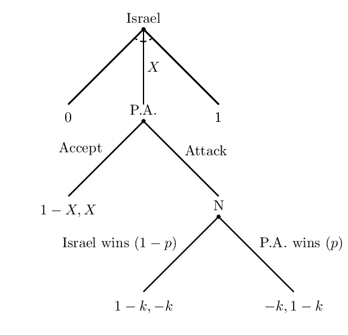
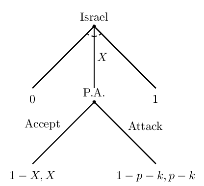

# Introduction
### Goal for Today

1. *Discuss, further, bargaining and war.*
2. *Understand when bargaining fails and war begins.*

### The Current Issue of Israel-Palestine

This is a touchy subject, so the treatment here will be brief.

- Israel and Palestine (P.A.) contest territory within what is legally recognized as the Israeli state.
- P.A. occupies considerable stretches of territory within Israel, clustered in the West Bank and the Gaza Strip
	- Israel occupies and governs the remainder of these territories.

Even more land is disputed between both sides.
 
- A peace deal is nowhere in sight.

### The Current Issue of Israel-Palestine

We can model this like we did with U.S.-Iranian strategic interaction.

- Israel can offer *X* of the territory to P.A., where $0 \le X \le 1$.
- P.A. can accept *X* or attack Israel.
- Whoever "wins" the attack will keep all the territory, minus the cost (*k*) of the attack.

### The Game Tree

### Solving for X

We can solve this by using **backward induction**.

- Importantly, we need to get rid of Nature.

We need to calculate Israel and P.A.'s expected utilities for the attack.

### Expected Utility for P.A. of the Attack

\begin{eqnarray}
EU(\textrm{P.A.} | \textrm{Attacks Israel)} &=& p(1 - k) + (1 - p)(0 - k)   \nonumber \\
   &=& p - pk + 0 - k - 0 + pk \nonumber \\
   &=& p - k \nonumber
\end{eqnarray}

### Expected Utility for Israel of the Attack

\begin{eqnarray}
EU(\textrm{Israel} | \textrm{Attacked by P.A.)} &=& p(0 - k) + (1 - p)(1 - k)   \nonumber \\
   &=& 0 - pk + 1 - k - p + pk \nonumber \\
   &=& 1 - k - p \nonumber
\end{eqnarray}

### The Game Tree, with Nature Removed

### Finding the Bargaining Space

Any offer of *X* that is greater than equal to each side's expected utility of fighting produces a deal.

- P.A.: *X* $\ge$ *p - k*.

What Israel would get (1 - *X*) must at least equal 1 - *k - p*. Therefore:

\begin{eqnarray}
1 - X &\ge& 1 - k - p     \nonumber \\
1 - 1 + k + p   &\ge& X \nonumber \\
k + p &\ge& X \nonumber
\end{eqnarray}

### A Representation of the Bargaining Space

# Bargaining Failure
### Bargaining Failure

When bargaining fails, war follows.

- Thus, we can understand system insecurity as the failure to peacefully bargain differences.

Generally, there are three reasons for bargaining failure.

1. Issue indivisibility
2. Asymmetric (incomplete) information
3. Commitment problems

## Issue Indivisibility
### Issue Indivisibility

We like to believe the good at stake could be meaningfully divided.

- e.g. U.S.-Iranian strategic interaction over uranium enrichment.
- Many goods in international relations are divisible.

There are some **indivisible goods** that cannot be meaningfully divided.

- One side will have all the good, other will have none of it.

The Israel-P.A. issue is a case where the good is practically indivisible.

### Issue Indivisibility

The issue at stake between Israel and P.A. is over territory.

- Territory should be divisible.
	- Land is tangible, over which a line could be drawn on a map.
- However, territory is the most war-prone issue in the international system.

Scholars have since learned over time that territory is an indivisible good.

- It benefits only the side that occupies and controls it.

### A Famous (Stylized) Case of Issue Indivisibility

The Franco-Prussian War can be understood as a war of issue indivisibility.

### A Famous (Stylized) Case of Issue Indivisibility

France and Prussia disputed territory, though the *casus belli* may have been the Spanish monarchy.

- Queen Isabella II abdicated her throne.
- Prussia recommended Prince Leopold of Hohenzollern-Sigmaringen as the new king.
- Leopold was an ethnic German suggested to rule a country under considerable French influence.

A two-king solution is a rather foreign concept in the realm of monarchical succession.

## Asymmetric Information
### Asymmetric Information

**Asymmetric information**, also known as **uncertainty**, is another cause of bargaining failure.

- Neither side has shared information about each side's probability of victory or costs.
- In other words, parts of the game are not common knowledge.

We already saw how incomplete information affected bargaining in the U.S.-Iranian example.

### A Simple Case of Asymmetric Information

Assume Israel thinks its probability of victory if attack is .8.

- i.e. 1 - *p* = .8, *p* = .2.
- Assume further that *k* is .1. for this simple exercise.

The greatest *X* Israel would offer under these circumstances is .3.

- i.e. *p* + *k* = .2 + .1 = .3

### A Simple Case of Asymmetric Information

Suppose the P.A. is more optimistic about its chances.

- i.e. *p* = .5, 1 - *p* = .5.
- We will hold *k* constant at .1.

The *minimum* that Palestine would accept from Israel is .4.

- i.e. *p - k* = .5 - .1 = .4.

### A Simple Case of Asymmetric Information

Notice what happened here.

- The maximum Israel would offer is .3.
- The minimum P.A. would accept is .4.

Both sides see more utility in fighting.

- Asymmetric information erases the possible values of *X* to which they could agree.

## Commitment Problems
### Commitment Problems

An anarchic international system creates **commitment problems** in international politics.

- Little exists to ensure negotiated settlements hold.
- There's no certainty both sides are bargaining in good faith.

The author identifies two types of commitment problems.

1. First-strike advantages
2. Time-inconsistency problems.

### First-Strike Advantage

Assume P.A. has a possible first-strike advantage, such that:

$$
p_{(first)} > p > p_{(second)}
$$

This means Israel has one too.

$$
1 - p_{(second)} > 1 - p > 1 - p_{(first)}
$$

### First-Strike Advantage

Israel does not attack first over negotiating if:

- $1 - p_{(second)} - k \le 1 - X$
- Equivalently: $X \le p_{(second)} + k$

This creates the following inequality.

$$
p_{(first)} - k \le X \le p_{(second)} + k
$$

Any offer of *X* in between those, should a value of *X* exist, induces negotiations over a first strike.

### First-Strike Advantage

This also means that $p_{(first)} - k < p_{(second)} + k$ must hold for there to be negotiations. Equivalently:

\begin{eqnarray}
p_{(first)} - k  &<& p_{(second)} + k    \nonumber \\
p_{(first)}  - p_{(second)} &<& k + k \nonumber \\
p_{(first)}  - p_{(second)} &<& 2k \nonumber
\end{eqnarray}

### First-Strike Advantage

Assume these values.

- $p_{(first)} = .7, p_{(second)} = .4, k = .1$
- Therefore, $p_{(first)} - k = .6$ and $p_{(second)} + k = .5$.

The inequality, $p_{(first)} - k \le X \le p_{(second)} + k$,  does not hold because .5 is not greater than .6.

- Alternatively, $p_{(first)}  - p_{(second)} < 2k$  is not true either.

Each side has a first-strike advantage and will look to use it.

### Time-Inconsistency Problem

A **time-inconsistency problem** is another type of commitment problem.

<!-- - It's when one side exchanges a good now for a good later. -->
- This doomed the land-for-peace idea from the Oslo accords in 1993.

If Israel concedes territory now in exchange for a good to be returned later, then it has empowered P.A. to better contest a new division of the territory.

### Time-Inconsistency Problem

Assume Israel has just conceded some *X* of the territory to P.A.

- Assume *X* < 1 and P.A. still prefers all the disputed territory.

Under these conditions, Israel has empowered P.A. to make another demand.

- P.A. has gained an advantage in *p*, which we label as *p* + $\Delta$

### Time-Inconsistency Problem

Why would Israel agree to concede anything in the first place?

- Concessions today embolden the recipient to make a demand for more concessions tomorrow.

This is particularly problematic for Israel's case.

- Hamas, one of the main actors in P.A., has denied Israel's right to exist.

# Conclusion
### Conclusion

War is ultimately a breakdown of the bargaining process.

- However, war is ex post inefficient.
- It happens because state leaders cannot locate or commit to an acceptable bargained settlement.

There are three classes of explanations for bargaining failure.

1. Issue indivisibility
2. Asymmetric information
3. Commitment problems
