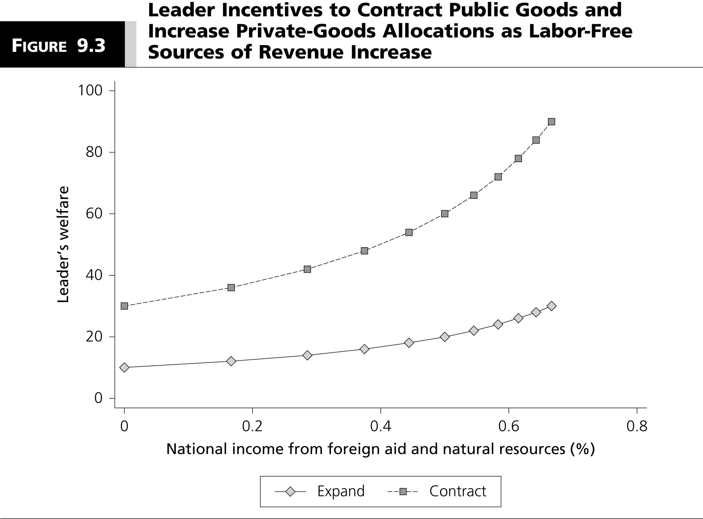

# Introduction
### Goal for Today

1. *Argue that an extreme form of terrorism (suicide terrorism) is rational/strategic.*
2. *Highlight how inferential fallacies and research design flaws can preclude a thorough understanding of the causes of suicide terrorism.*

# The Problem of Foreign Aid
### The Problem of Foreign Aid

We'll be discussing **foreign aid**, defined as:

- The contribution of money, goods, or services to non-domestic actors for free or non-market prices.
- NGOs (e.g. Red Cross) can distribute foreign aid, but we'll focus on government-to-government foreign aid.

### The Problem of Foreign Aid

Foreign aid (especially in the U.S.) has become a politically charged topic.

- It mostly fails to alleviate poverty, injustices, or inequalities.
- It routinely goes to the worst human rights abusers.
- It disincentivizes domestic development from the recipient.
- It's also subject to kleptocracy and misappropriation as well.

Why do we routinely observe the failure of what otherwise looks like "good" intentions?

### The Exemplar of the Marshall Plan

### What Can the Marshall Plan Tell Us?

The Marshall Plan remains the most ambitious (and essentially the first) U.S. aid plan and to much fanfare.

- We routinely connect U.S. aid to Europe's successful reconstruction.

Did the Marshall Plan actually *cause* Europe's recovery?

- The two clearly correlate (at least among those who did and did not receive aid).

However, the Marshall Plan may have worked because it was a *conditional* aid program.

- U.S. demanded important policy concessions (e.g. free markets, balanced budgets).

### What Can the Marshall Plan Tell Us?

The success of the Marshall Plan may be limited to just Western Europe.

- WWII notwithstanding, Europe still had plenty of **human capital**.
- We've seen more failures than success stories for foreign aid in the developing world.

## The Aid Debate
### The Aid Debate

General agreement: foreign aid fails to meet its proposed goal for growth for the recipient.

- However, we disagree about the reasons why.

Jeffrey Sachs: rich countries don't give enough aid.

- e.g. the U.S. spends less than 1% of its budget on aid.
- However, this ignores that the amount of aid spent is an equilibrium strategy; the donors know they do not spend enough to reduce poverty.
- If aid has little impact on growth, then perhaps it is not intended to achieve growth.

### The Aid Debate

William Easterley (other economists): recipient governments steal the money or use it ineffectively; aid should be given to local entrepreneurs.

- However, this does not consider the *political* consequences.
- Local entrepreneurs will be either co-opted or repressed by the government.

Perhaps we've been mistaken about aid's purpose.

- i.e. do donors and recipients ultimately care about poverty and injustice in the aid allocation process?

# A Selectorate Theory Approach
### A Selectorate Theory Approach

A strategic approach could prove useful for understanding this problem.

- Foreign aid is given to buy policy concessions, not alleviate poverty.
- Aid programs *are* successful for this purpose *only*.
- Aid gives leaders the resources to solve societal problems, but incentives do to the opposite.

### Selectorate Theory Approach and Aid's Key Questions

What does this mean for our key questions of foreign aid.

1. Who gives aid?
	- Wealthy countries with large W/S.
2. Who receives aid?
	- Poor countries with small W/S.
3. How much aid is given/acquired?
	- Wealthy countries spend the most, to a point.
	- Wealthier more democratic countries receive the most, to a point.
4. What are the internal economic consequences of aid?
	- Aid depresses economic and societal growth.
5. What are the political consequences of aid?
	- Aid depresses democratization efforts, despite proclamations to the contrary.

## Aid and Democratization
### Aid and Democratization

Does aid increase democratization?

- Conventional wisdom: yes, indirectly. Aid promotes growth; growth promotes democracy.
- Selectorate answer: no. Aid inhibits democratization pushes.

### Aid and Democratization

We know governments produce public goods, among them: **coordination goods**.

- The more coordination goods, the less likely citizens rebel.
- However, the more coordination goods, the *more* likely citizens would succeed in a rebellion.

### Aid and Democratization

Let's offer a simple model of this scenario with these actors:

- *L*: incumbent head of state, who chooses to increase/decrease public goods.
- *C*: citizen, who chooses to revolt against or stay loyal to *L*.
- *D*: democratic revolutionary and challenger to *L*.
	- Note: in this model, *D* does not move.
	
### Aid and Democratization

A few other key terms:

- *g*: public goods spent by *L*.
	- public goods have an implied unit price of *p*.
- *z*: private goods spent on *W* by *L*.
	- private goods have an implied unit price of *W*.
	- You should know what *W* is already.
- *t*, *T*: proposed taxation rate by *L* and *D* (respectively).
	- Note: *t* > *T* (i.e. *D* is promising lower taxation rate than *L*).
- *k*: cost parameter for citizens associated with revolt.
- *r*: probability of successful revolt by citizens. 

### Aid and Democratization

Some more key terms:

- *R*: (somewhat) labor-free sources of revenue (e.g. natural resources and foreign aid).
	- *R* + *t*$g_{L}$: total government revenue for incumbent *L*.

Also note: *R* + *t*$g_{L}$ $\ge$ *p*$g_{L}$ + *W*$z_{L}$
	
- i.e. total government revenue must be greater than or equal to the total cost of public and private goods.
- This is called a **budget constraint**. (i.e. we're ignoring deficit spending for simplicity)
- Likewise: *R* + *t*$g_{D}$ $\ge$ *p*$g_{D}$ + *W*$z_{D}$

### A Simple Game

### A Simple Game

What's happening in this game?

- *L* faces a credible threat from *D*
- *L* chooses to placate (or disconcert) *C* with more or less public goods.
	- Recall our discussion of coordination goods.
- *C* chooses to revolt (or not) after *L*'s decision.

*C* revolts if its utility for doing so is greater than the public goods *L* offers it.

### To Revolt or Not to Revolt?

### The Resource Curse

# Conclusion
### Conclusion

- Foreign aid provides the right amount of aid for enhancing leader survival.
- Foreign aid is intentionally given to leaders and governments that are corrupt.
- Foreign aid reduces economic growth and harms prospects for democratization.
- Survival-oriented democratic donors do what "We the People" want them to do, and it would be antidemocratic for them to do otherwise.
- If we REALLY want to alleviate poverty, we will put the really poor ahead of ourselves and then our leaders will increase aid and prevent its being stolen.

### Conclusion (2)

There are multiple threats to leader survival.

- Free resources affect
- Resource curse
