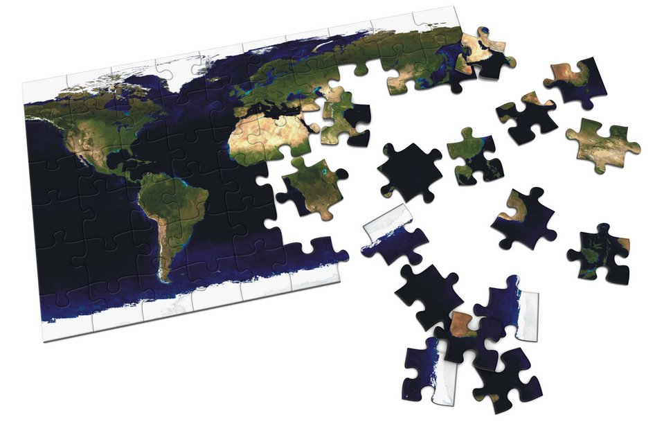

# Introduction
### Goal for Today

1. *Conceptualize and reconceptualize the essential character of international politics.*
2. *Discuss significant shortcomings in standard IR paradigms.*
3. *Build toward a better "strategic" understanding of international relations.*

### Introduction

The previous lecture suggests we need to rethink our foundations.

- What are the basic principles of international politics?
- What are the basic puzzles of international politics?
- What are the basic pillars to understand international politics?

Unitary actors pursuing power/national security aren't the essential character of IR.

# Rethinking the Foundations of IR
## Three Principles of International Politics
### Three Principles of International Politics

We have three assumptions that guide how we should understand IR.

1. State leaders are motivated by their desire to retain office.
2. International relations cannot be separated from domestic politics.
3. State leaders make decisions *strategically*.

### Three Principles of International Politics

Implications of these three principles.

- Game theory is a means to understanding strategic interactions.
- Our unit of analysis is the state leader, not the "nation".
- Good politics may make for bad policy (and vice-versa).
- National interest is subservient to the personal interest of the leader.
- Foreign policies have important domestic political consequences.
- Power is not determinant of outcomes.
- Leaders make decisions; nations do not react.

## Solving IR Puzzles
### Why Think in Puzzles?

### Thinking in Puzzles

Zinnes' (1980) famous address highlights the benefit of "puzzlement".

- A path to richer theory-building.
- Forces scholars to think like detectives and look for non-obvious solutions.
- Separates basic questions from puzzles.

### The Puzzles of International Politics

There are four broad categories of puzzles in international politics.

1. Coordination
	- How do state leaders act together to pursue common goals?
2. Distribution
	- How do state leaders allocate scarce resources among themselves?
3. Monitoring
	- How can state leaders detect cheating on international agreements?
4. Sanctioning
	- How can state leaders *punish* cheating on international agreements?

How do you see current events fitting within these overall puzzles?

## Three Pillars of International Politics
### Three Pillars of International Politics

How can we explain decision-making regarding these four puzzles?

1. Power
2. Preferences
3. Perceptions

# Conclusion, Looking Forward
### Conclusion, Looking Forward

We're going to spend the next three weeks on method.

- This will get us to the midterm.

Thereafter, we'll go mostly by topic to address various puzzles in IR.

- Why do states go to war?
- Why don't democracies fight each other?
- Why do sociopolitical groups engage in terrorism campaigns?
- Why doesn't foreign aid have the desired effect?
- Why do the biggest IGOs (like the UN) seem ineffective, but why are smaller ones (like OPEC) beset with major divisions?

