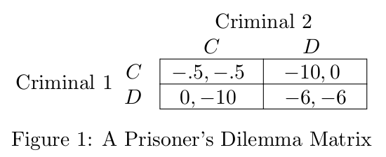
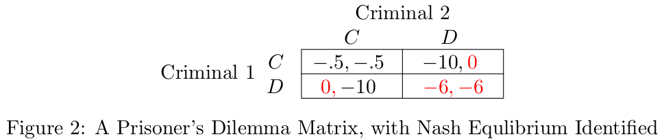
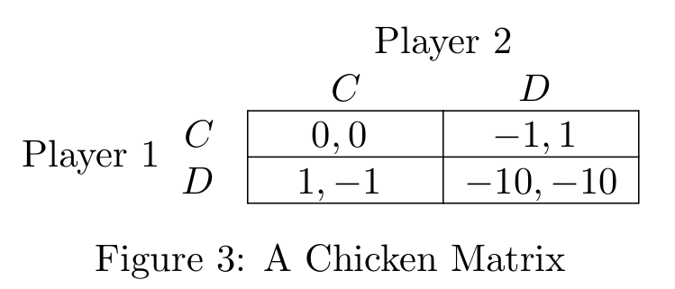
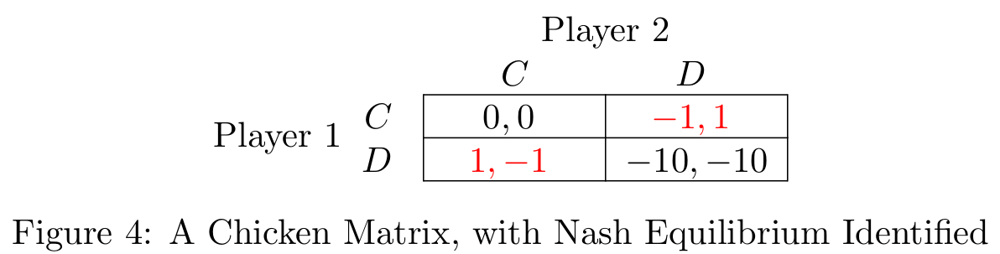
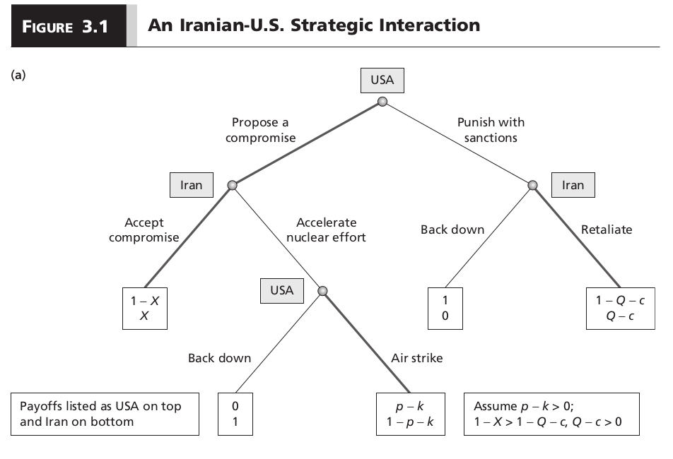
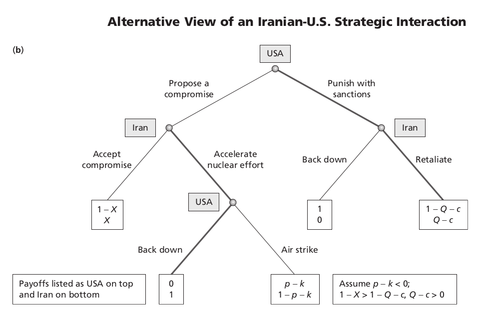

# Introduction
### Goal for Today

*Learn some game theory.*

### Recall Our Previous Discussion

We need a way of modeling the strategic dilemma of Iranian nuclear
development.

- Iran wants a nuclear energy industry, knowing the U.S. does not want that for them.
- The U.S. wants Iran to abandon its nuclear program, knowing that Iran is invested in the outcome.
- One side can’t pursue its interest without adversely affecting the other side’s payoff.

What tools do we have to model this strategic situation?

### Game Theory

**Game theory** is a tool that tells us how individuals maximize their utility when other actors are trying to do the same over some good.

- Simply put, it models strategic decision-making.

We're really interested in **noncooperative game theory**.

- Definition: players can’t interact beyond making decisions

# Normal Form Games
## Prisoner's Dilemma
### Prisoner's Dilemma

The **prisoner's dilemma** is one of the most ubiquitous pedagogical games in game theory.

- It’s a useful description for most of international politics.
- In short: it’s a situation when the mutually optimal outcome is individually irrational.
	- Much like the heart of international politics.
- Demonstrates individual-level pursuit of self-interest can have perverse group consequences.

### The Situation

The players (Criminal 1, Criminal 2) have just robbed a bank.

- The police has insufficient evidence for a serious conviction.
- The fuzz has only enough evidence for a minor, unrelated conviction.

In custody, detectives isolate the criminals and try to coerce a confession.

- Assume there's a prior commitment from both criminals to clam up.
- However, this can't be enforced (noncooperative game theory).

### The Situation and the Payoffs

The criminals have only two choices: cooperate (*C*) (with each other, by clamming up) or defect (*D*) to the police.

- If they both keep quiet: police can only pursue the minor conviction.
- If one defects while the other keeps quiet: the rat turns state's evidence, the other gets the books thrown at him.
- If they both rat on each other, they get a partial sentence for making things easy for prosecutors.

### The Prisoner's Dilemma, in Payoff Matrix Form

### Solving the Prisoner's Dilemma

Solving this (or most any) game requires finding a **Nash equilibrium**.

- Definition: the outcome of a game when no player has an incentive to *unilaterally* change behavior.

How can you find this?

- Find best responses for each potential decision and highlight it for a specific player.
- The quadrant(s) where each payoff is highlighted is a Nash equilibrium.

### The Nash Equilibrium of a Prisoner's Dilemma

### The Implications of the Prisoner's Dilemma

In situations with payoffs structured like the prisoner's dilemma, the prospects for cooperation versus conflict look dim.

- *D* is a **dominant strategy**. Each player is better off choosing *D* no matter what the other player does.
- Ideal payoffs per player: *DC > CC > DD > CD*.
	- This can be rewritten as *T > R > P > S*, as in your book.
	- *Ordinal* payoffs are all that matter in a single-shot game.
- The Nash equilibrium is **Pareto inferior**.
	- The "best" outcome is when no player can maximize her payoff without making some other player worse off is the **Pareto efficient** outcome.
	- Clearly, the Pareto efficient outcome is *CC*, though rational players won't choose *C*.

## Solve Your Own Game
### Chicken

Anyone heard of a game of "Chicken" before?

### Chicken

Can you solve a game with Chicken payoffs (*T > R > S > P*)?

### Chicken

# Extensive Form Games
### Extensive Form Games

Normal form games are fun, but can be limiting.

- We often have more than two players.
- We often observe an order of moves.

**Extensive form games** allow us to model these games where play is sequential and moves can be observed.

### Designing Extensive Form Games

Extensive form games look like, and are commonly called, "game trees".

- Players make decisions at **choice nodes**.
- Outcomes are linked by **branches**.
- Games end at the **terminal node**.

## An Iranian-U.S. Strategic Interaction Game
### Iranian-U.S. Strategic Interaction

Recall our previous discussion of the Iranian-U.S. strategic dilemma.

- U.S. can offer level of nuclear development *X* to Iran as a compromise.
- Iran can accept it or risk an attack (with success of probability *p*) at joint cost *k*.
- Any offer of *X* between *1 - p - k* and *1 - p + k* induces a compromise.

### Iranian-U.S. Strategic Interaction

What's missing here?

- Moves in this strategic interaction have been sequential.
- The U.S. also has the option to sanction.

We can and should model this.

### An Iranian-U.S. Strategic Interaction Game

### Solving an Extensive Form Game

Extensive form games are solved by using **backward induction**.

- Players play games ex ante (calculating payoffs from the beginning) rather than ex post (i.e. hindsight).
- They must anticipate what their choices to begin games might do as the game unfolds. 
- In short, we can solve a game by starting at the end and working back to the beginning.

This works only in **complete and perfect information** games.

- Complete: all payoffs are common knowledge.
- Perfect: all prior moves can be observed.

### Solving an Extensive Form Game

Outcomes are expressed as **subgame perfect Nash equilibrium**.

- Even if we don't observe a particular choice node, it's still an important component of the equilibrium concept.

### Some Assumptions

Assume the following:

- *p - k > 0* (i.e. attacking Iran is nominally inexpensive for the U.S.)
- *1 - X > 1 - Q - c* (i.e. the U.S. sees value in a deal over sanctions).
- *Q - c > 0* (i.e. Iran will resist if sanctioned).

### How Do You Solve This?

### The Outcome of the Game

- If Iran accelerates its nuclear development, the U.S. will go with an air strike (*p - k > 0*).
- If the U.S. offers a deal of *X*, Iran will accept it. It knows the U.S. will attack if it doesn't.
	- Only if $X \ge 1 - p - k$, from our previous discussion.
	- We *don't* expect the U.S. to move to end the game, but we model that process anyway!
- If the U.S. sanctions, Iran will retaliate (*Q - c > 0*)

### An Alternative Version

Assume *p - k < 0* (i.e. attacking Iran is prohibitively costly for the U.S.) What happens?

# Conclusion
### Conclusion

Spatial models and expected utility calculations by themselves do not allow strategic behavior.

- Alone, they are insufficient to understand IR, where actors adopt policies endogenously, based on the logic of the situation.

Game theory provides tools for working out how stakeholders are likely to interact strategically.

- This chapter presents some basic concepts of game theory and demonstrates them using the example of the Iranian nuclear program.

