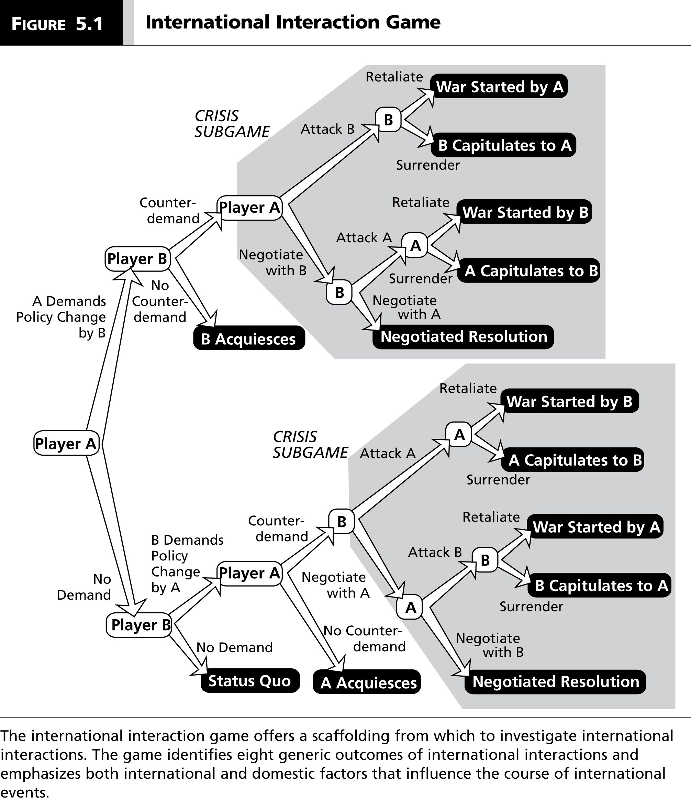
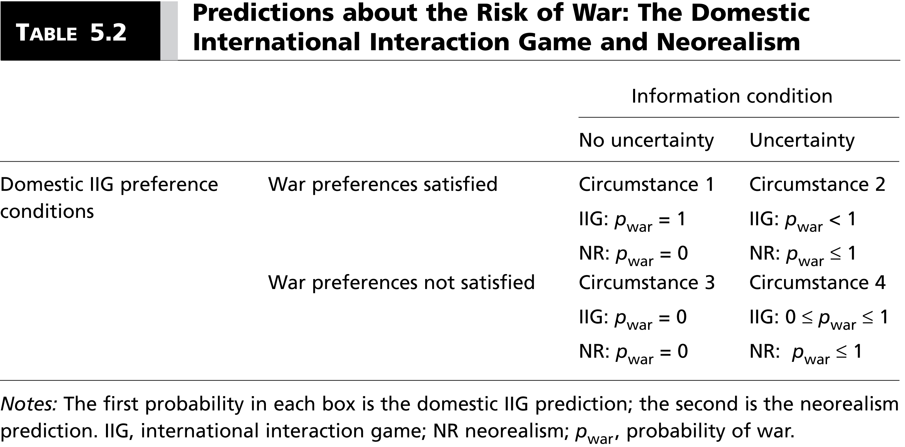
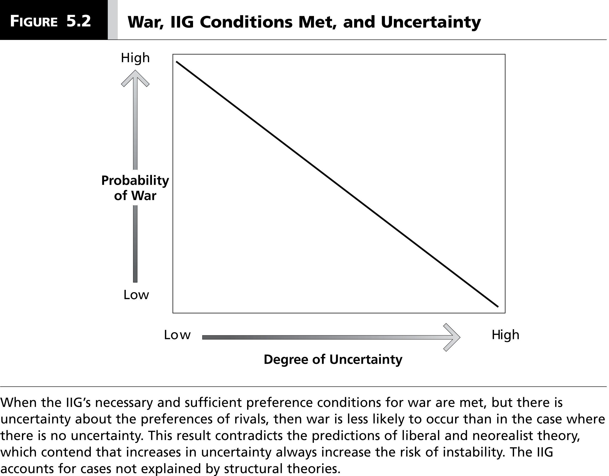
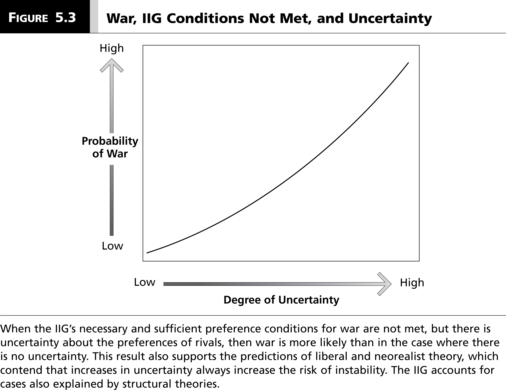

# Introduction
### Goal for Today

*Distinguish the predictions of the author's strategic perspective from neorealism.*

### A Motivating Puzzle: NATO and Serbia

Why would NATO bomb Serbia? Why would Serbia provoke NATO?

### A Motivating Puzzle: NATO and Serbia

Notwithstanding metaphors and history, Serbia was no threat to Europe.

- However, leaders in Europe felt the *domestic* costs of doing nothing was worse than attacking Serbia.

Milosevic was no match for NATO, but was *highly* motivated.

- The issue was sufficiently important.
- Milosevic believed (with reason) that NATO resolve was negligible.

Domestic and foreign *strategic* factors explain this conflict, not the balance of power.

### This Lecture

We will contrast the assumptions and predictions of neorealism with the author's strategic perspective.

- Neorealism: states maximize security in response to balance of power.
- Strategic: leaders choose foreign policies as a function of domestic and international constraints.

What follows is a more general understanding of uncertainty, war, and state leader type (i.e. hawks and doves).

# The International Interaction Game
## A Description of the Game
### The International Interaction Game

### Possible Outcomes of the Game

1. The status quo
2. A negotiated settlement
3. A (or B) acquiesces.
	- i.e. one side concedes the issue without being attacked.
4. A (or B) capitulates.
	- i.e. one side concedes the issue *after* a preliminary attack.
5. A (or B) retaliates to an attack.
	- i.e. both sides fight a war.

### Assumptions of the Game

1. Decision-makers are rational and strategic.
2. *p*=1 or *p*=0 **only** for acquiescence, capitulation, or status quo.
	- i.e. the utility of all other outcomes is weighted by probability.
3. The utility of negotiation or war is a lottery
	- $p_A$, $p_B$ = probability of "winning" the lottery
	- $1 - p_A$, $1 - p_B$ = probability of "losing" the lottery.
	- Do note these are not identical variables.
4. Each state leader prefers negotiation over war.
	- This is also common knowledge.

### Assumptions of the Game

5. Violence involves costs *not* associated with negotiations.
	- Capitulation: the capitulating state eats the costs of the attack.
		- This also implies a first-strike advantage.
	- Any attack: the attacking state incurs costs associated with failed diplomacy.
6. Both A and B prefer any policy change to the status quo, but: $SQ_i > ACQ_i$.
7. Foreign policies follow domestic political considerations.
	- These may or may not include consideration of international constraints.

### Additional Restrictions of the Game

These assumptions imply the following preference restrictions.

- SQ > Acquiescence or capitulation by A (or B).
- Acquiescence (by the opponent) is most preferred outcome.
- Acquiescence by $i$ > Capitulation by $i$.
- Negotiation > Acquiescence/capitulation/an initiated war by $i$.
- Capitulation by $i$ > Initiated war from $j$
- War started by $i$ > War started by $j$
- Capitulation by $i$ > zero in negotiations
- War started by $j$ > zero in negotiations.

### Major Difference with a Neorealist Model

Importantly. *U*($Capitulation_j$) can be greater than *U*($Negotiation_j$)

- where *j* refers to the opponent (i.e. B for A and A for B).

In neorealism, this is not a possible assumption.

- States prefer to *survive*, not obtain maximum power.
- Thus, demands from states should be tailored to maintain system stability.

This is why previous versions of bargaining we discussed aimed for indifference between negotiation and war.

## Outcomes of the Game
### Outcomes of the Game

War is the complete and perfect information equilibrium *iff* (sic):

1. A prefers to initiate war > acquiescence to B's demands.
2. A prefer to capitulate, but B has a first-strike advantage.
3. B prefers to fight a war started by A rather than acquiesce to A's demands.
4. B prefers to force A to capitulate rather than negotiate.
	- We call this a "hawk" in this game.
	- A "dove" prefers negotiations over a first-strike.

### Outcomes of the Game

Under uncertainty, this no longer holds.

- However, *uncertainty doesn't automatically lead to higher probability of war*, per neorealism.

Assume A mistakes that B is a dove (when, in fact, B is a hawk) and B mistakenly believes A would retaliate, if attacked.

- A offers negotiation to B.
- B responds with negotiation to A.

Uncertainty about preferences can avert a war that would have occurred with complete and perfect information.

### Uncertainty and Predictions of War

### Uncertainty and Predictions of War

### Uncertainty and Predictions of War

## War Amid Resurrection and Pacific Doves
### Resurrection and Pacific Doves

Realists believe power invariably increases belligerence.

- After all, relative power increases the probability of winning a war.

However, there are several reasons why *weak* states/groups are the aggressor.

1. The Resurrection Hypothesis
2. The Pacific Dove Hypothesis

### The Resurrection Hypothesis

When leaders face defeat in war (and removal from office), they gamble.

- **Resurrection hypothesis**: leaders facing certain defeat lose nothing by fighting harder.

Common examples:

- Battle of the Bulge (Hitler, 1944)
- Tet Offensive (Ho Chi Minh, 1968)
- Iraq War (Saddam Hussein, 2002-3)

### The Pacific Dove Hypothesis

**Pacific Dove Hypothesis**: Weak states/groups have incentives to initiate disputes/war even if they ultimately prefer negotiations. Explanations:

- Strong states have initial advantage in negotiation.
- Choosing to negotiate means forgoing whatever first-strike advantage the weak state has.

Thus, the pacific dove plays a low-probability lottery that the stronger state is not motivated to fight back.

- This could make the dove's demands in negotiation more credible.
- However, it makes negotiations that much more unlikely.

# Conclusion
### Conclusion

The IIG bears out the predictions of the author's strategic perspective over neorealism.

- War can be a complete and perfect information equilibrium.
- Uncertainty does not automatically increase the probability of war.
- States/groups facing defeat can be more likely to take initiative.
- Pacific doves are more likely to initiate conflict than gain nothing in negotiations.

