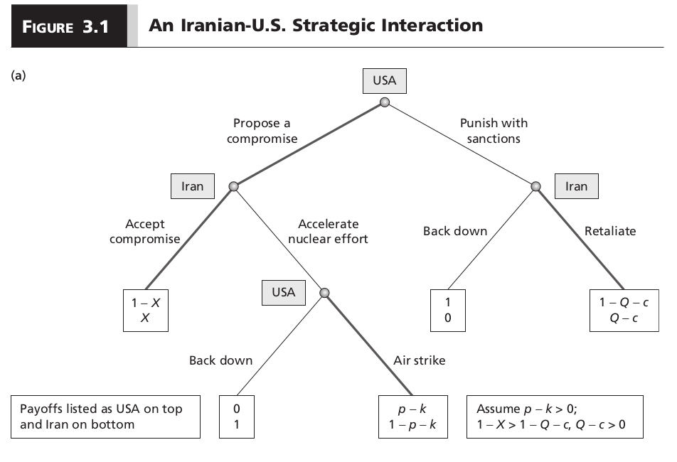
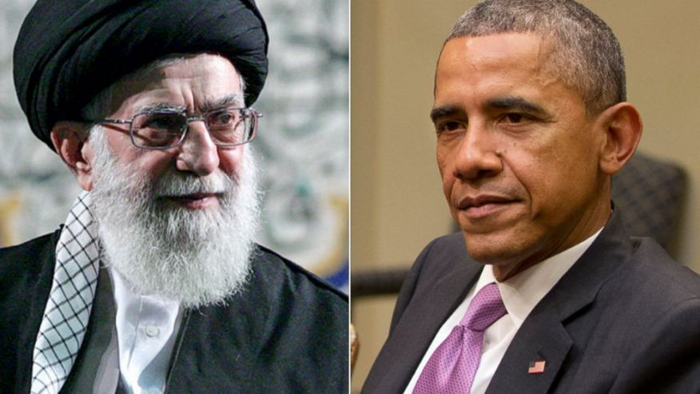

# Introduction
### Goal for Today

*Discuss importance of incomplete information in game theory.*

### Recall our Previous Discussion

Iran-U.S. strategic interaction is more than an expected utility problem.

- The U.S. has the option to sanction Iran or offer a deal.
- Iran can accept a deal, if offered, or reject it.
- If Iran rejects, the U.S. may consider attacking Iran.

### Iran-U.S. Strategic Interaction Game

### Solving the Game

Solving the game requires knowing if the U.S. has value in attacking Iran.

- When *p - k > 0*, the U.S. induces Iran to accept a deal.
- When *p - k < 0*, the U.S. sanctions Iran instead of offering a deal that gets rejected.

Both are subgame perfect Nash equilibria (under different assumptions) when the game is one of complete and perfect information.

### Making the Problem More Interesting

Subgame perfect Nash equilibrium is fine only under conditions of complete and perfect information.

- i.e. Iran/U.S. know, with certainty, that *p - k > 0* (or *p - k < 0*)

When one or the other is true, and everyone knows it, we can solve the game rather simply.

- The probability of an attack is effectively zero as well.

### Incomplete Information

What if Iran doesn't know Obama's payoffs?

- That is: Khameini doesn't know if *p - k > 0* or *p - k < 0*.

We already know Iran prefers a compromise if the former condition were true, but Iran will get (and accept the costs of) a sanctions regime if the latter were true.

### The Uncertainty in Iran-U.S. Strategic Interaction

This suggests Obama may know his resolve on the issue, but Iran doesn't know how committed the U.S is.

### The Uncertainty in Iran-U.S. Strategic Interaction

Why Iran has reason to believe *p - k > 0*.

- U.S. public opinion is fairly united on the Iran nuclear issue.
- USAF power *far* exceeds Iran's defenses.
- Iran has no (good) allies in the region, nor likely assistance from Russia and China.

Why Iran has reason to believe *p - k < 0*.

- Iran's nuclear facilities are well-concealed, protected, and diffuse.
- An air strike would torpedo U.S. standing in the region.
- The U.S. public may have war fatigue.

Obama may know if the U.S. is committed (i.e. *p - k > 0*), but Khameini has (credible) reasons to believe that Obama's threats are hollow.

# Incomplete Information and the Case of Iran's Nuclear Ambitions
### Incomplete Information

In short, this strategic situation is one of **incomplete information**.

- *Definition*: situations in which the characteristics of a strategic game (e.g. player type, action, beliefs, preferences) are not common knowledge.

In our example, Khameini doesn't know for sure whether Obama is committed or not committed to this issue.

- With probability *R*, Obama is weak (i.e. *p - k < 0*).
- With probability *1 - R*, Obama is strong (i.e. *p - k > 0*).

### The New Game

### The Game with Uncertainty

The new game is much more interesting.

- Nature assigns a type (weak or strong) to the United States.
- The U.S. knows its type, but Iran does not.
	- You can think of this in poker logic. It'd be illustrative.
- Khameini and Iran's belief of the U.S. type is expressed in probability (*R, 1 - R*).

## Solving This Game
### Understanding the Game

We can illustrate how the game unfolds by plugging in some values.

- Assume, for simplicity: *p* = .75, *k* = .20.

The U.S. has a fairly high confidence that it can attack Iran, and cheaply.

- However, Iran does not know this!
- It can only assume with probability *1 - R* that this might be the case.

### Understanding the Game

The U.S. knows its expected utility of attacking Iran is .55 (i.e. *p - k* = .75 - .20 > 0).

- Iran's expected utility of being attacked (as the U.S. calculates it) is .05 (i.e. *1 - p - k* = .05).

There's your bargaining space, by the way: .55 $\ge X \ge$ .05.

- The most the U.S. would offer is just short of research into weapons-grade fuel.
	- See: Figure 2.1.
- The least Iran would accept (as the U.S. calculates it) is *X* = .05.
	- Incidentally, this approximates the level to which both sides agreed in Vienna.

Ths U.S. will make the minimal offer (to maximize its utility), which it expects Iran to accept.

### When the Minimum is No Longer Acceptable

However, Khameini would *reject* this offer in a world of uncertainty.

- Recall: Iran accepts the minimum offer only when it is 100% convinced an air strike would follow a rejected deal.
- i.e. Iran would accept *X* = .05 only when *R* = 0.

The moment *R* > 0 is the moment Khameini needs a better offer in order to accept a compromise.

## Calculating Payoffs Under Uncertainty
### Calculating Payoffs Under Uncertainty

How does this work?

- Recall: Khameini believes the U.S. is weak with probability *R* and the U.S. is strong with probability *1 - R*.
- If the U.S. is weak and Iran rejects the U.S. offer, Iran gets a 1 (i.e. the U.S. backs down).
- If the U.S. is strong and Iran rejects the U.S. offer, the U.S. attacks.
	- Iran's payoff would be *1 - p - k = 1 - .75 - .20 = .05*.

Iran receives a payoff of 1 with a probability of *R* and a payoff of .05 with probability *1 - R*.

### Calculating Payoffs Under Uncertainty

What happens to this if the U.S. offers *X* = .05 while *R* = 0?

\begin{eqnarray}
EU(\textrm{Iran} | \textrm{Reject Compromise)} &=& R(1) + (1-R)(.05)      \nonumber \\
   &=& 0(1) + (1-0)(.05) \nonumber \\
   &=& .05
\end{eqnarray}

The offer is the minimum that Khameini would accept over risking an attack from the United States.

### Calculating Payoffs Under Uncertainty

What happens to this if the U.S. offers *X* = .05 while *R* = .01?

\begin{eqnarray}
EU(\textrm{Iran} | \textrm{Reject Compromise)} &=& R(1) + (1-R)(.05)      \nonumber \\
   &=& (.01)(1) + (1-.01)(.05) \nonumber \\
   &=& .0595
\end{eqnarray}

Khameini *rejects* what the United States otherwise believes is the minimum acceptable offer.

- Iran is not 100% convinced that *p - k* > 0.
 

## Making a Better Deal
### Making a Better Deal

Under uncertainty, the U.S. offer must be more attractive for Iran.

- *But* it should still be more attractive for the U.S. than sanctions, per our assumptions ($1 - X \ge 1 - Q - c$).

Assume: *Q* = .20, *c* = .10.

- The U.S. values a compromise of *X* when $1 - X \ge 1 - .2 - .1$.

The minimum value of *X* that satisfies this is .3.

- The U.S. maximizes its utility with sanctions if *X* > .3.

### Making a Better Deal

What if the U.S. offers *X* = .3 to Iran?

- It would be an improvement for Iran from the status quo of *X* = .2.

However, we do not know if Iran would actually accept this.

- After all, Iran is unconvinced that *p - k* > 0 for the U.S.

Thus, we need to know when $.30 \ge R(1) + (1 - R)(1 - .75 - .20)$.

### Would Iran Accept *X* = .30?

\begin{eqnarray}
.30 &\ge& R(1) + (1-R)(1 - .75 - .20)     \nonumber \\
.30   &\ge& R + 1 - .75 - .20 - R + .75R + .20R \nonumber \\
.30   &\ge& 1 - .75 - .20 + .95R \nonumber \\
.30 - 1 +.75 +.20   &\ge& .95R \nonumber \\
.25  &\ge& .95R \nonumber \\
\nonumber \\
\frac{.25}{.95} &\ge& R
\end{eqnarray}

### Would Iran Accept *X* = .30?

What does this say in plain English? 

- Khameini accepts the compromise offer of $X = .3$ (the most the United States would grant over sanctions) when Iran's probability of the United States $not$ attacking Iran is, at the most, $\frac{.25}{.95}$, or $R = .263$.

If Iran believes *R* = .50, for example, then the U.S. should sanction.

- However, the threat of bargaining failure (i.e. war) looms large.

# Conclusion
### Conclusion

Differences of subjective beliefs about payoffs and observed actions complicate states' ability to locate a bargaining space.

- One way the U.S. can credibly parlay to Iran that it is strong (i.e. *p - k > 0*) is through sending a **costly signal** to Iran.
- A public threat on television from Obama could be credible if it informs Iran of U.S. resolve.
- Private threats via negotiation are often **cheap talk** that don't communicate meaningful information.
