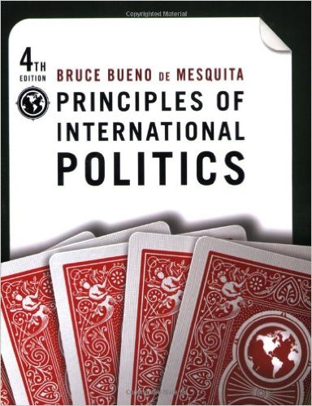

# Introduction
### Goal for Today

Familiarize students with the topic of the course and the instructor's expectations.

# Structure of POSC 1020
### Structure of the Course

My goals for this class are multiple. These include:

- How to *evaluate* arguments in international politics.
- How to conceptualize and model behavior by foreign policy actors.
- Getting students over "math anxiety".

\bigskip Topically, we'll cover several topics in IR. These include:

- War and peace
- Bargaining
- Democratic peace
- Terrorism
- Foreign aid
- IGOs and international law

# POSC 1020 Syllabus
### Course Objectives

- Learn how to construct and evaluate arguments in international politics.
- Appreciate that all international politics are strategic problems.
- Understand basic elements of expected utility and game theory.
- List basic arguments for war and peace.
- Understand the rationality of terrorism.
- Understand situational effectiveness of foreign aid.

### Book

### Grading Policy and Important Dates

- Midterm 1: (October 1) [**20%**]
- Midterm 2: (November 5) [**20%**]
- Article summaries (due through semester) [**20%**]
    - See syllabus for pertinent information.
- Final: (December 10, 8 a.m.) [**30%**]

Attendance and participation will be the final 10% of your grade.

## Course Policies
### Course Policies

*Read the syllabus*. I'll reiterate the following:

- **Attendance**: Effectively mandatory. You get five unexcused absences.
- **Participation**: I may "cold-call" you to answer a question. 
    - You should *at least* give a convincing partial answer.
    - If you don't (or are absent), you'll get a point deduction from your overall grade.
- **Make-up Exams**: Don't bother asking. The answer is no.
- **Cell phones, laptops, etc.**: Put them away.
- **Academic dishonesty**: Don't be that guy...
- **Disabilities**: let me know ASAP (privately) if you need accommodations
    - Student must initiate the process *each semester*.
    - Student must schedule room at testing center (if necessary).

# Etiquette and Expectations
### My Contact Information

- *Name*: Steve Miller (as in the band)
- *E-mail*: \textcolor{clemsonorange}{svmille@clemson.edu}
- *Office Hours*: Wednesday: 9-11:30 a.m.
- *Office*: 230A Brackett Hall
- *Website*: \textcolor{clemsonorange}{svmiller.com/teaching}

### Additional Course Materials

I don't like Blackboard. I only intend to use it for:

- Turnitin (and grading the Turnitin assignments)
- Classwide e-mails

\bigskip I do like making lectures publicly available, though.

- Check course website at \textcolor{clemsonorange}{svmiller.com}
- Check my Github repository (just in case): \textcolor{clemsonorange}{github.com/svmiller/posc1020}

### My Expectations

I come off as a bit cruel in my expectations.

- I expect a lot, and I expect a commitment from you.
- Otherwise, why bother? Your job is to become "pro-ready".

\bigskip I also expect it to be a bit difficult for you.

- My philosophy: if you 100% understand something the first time you read it, you didn't learn anything.
- Read and re-read if necessary.
- Lectures should help, but they're not sufficient. You need to read.

\bigskip I take seriously the "science" of political science.

- This will constitute a large part of the first half of the class.
- I am *more* than generous with study guides.
- I'm also eager to help in-class or office hours.

\bigskip I don't care for whom you'll vote or what you saw on TV. *Don't bring it up*.

### Etiquette Concerns

In-class:

- Raise your hand and ask a question the *moment* something doesn't make sense.
    - I do have a bad habit of talking a bit fast.
- *Do the reading before class*. Seriously.
- Resist the urge to write down every word on a slide.
    - Listening is more important than reading in this context.

### Etiquette Concerns

Outside class: 

- **Resist the urge** to e-mail me if you missed a class (for which there wasn't an exam).
    - Short answer: you missed what was on the syllabus.
- Please use conventional e-mail etiquette.
    - This is a good professional exercise for you.
- I'm usually in my office Tuesday and Thursday mornings before class.
- Knock first, even when the door is open.
- You may not use my office supplies.
- I am not a study session. Come prepared with something specific to ask or discuss.
