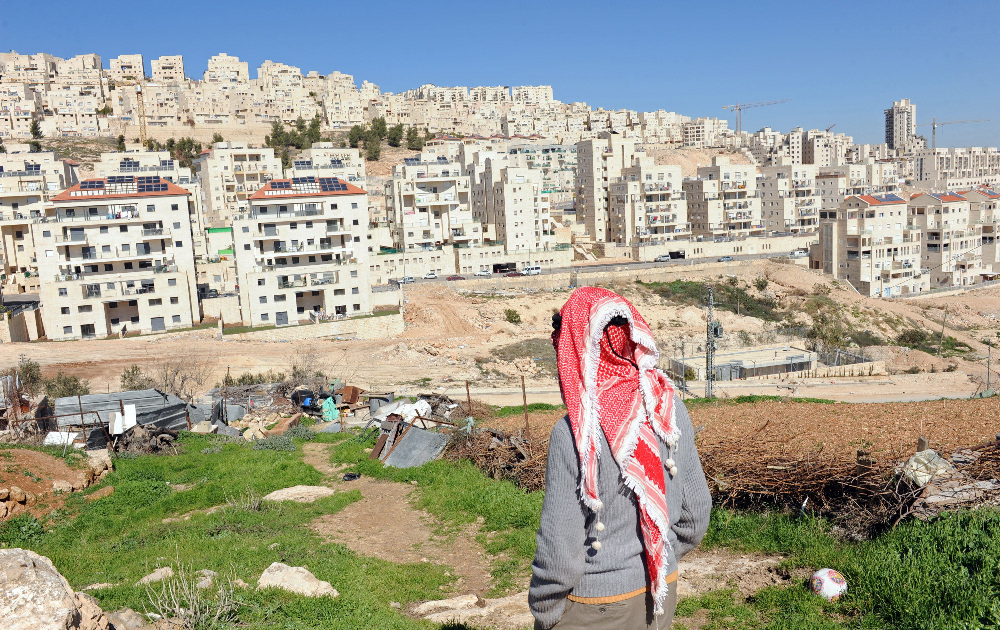

# Introduction
### Goal for Today

1. *Build toward a strategic perspective of IR.*
2. *Highlight the important inter-play between domestic politics and foreign policy.*

# Why Open the Black Box of the State?
### Opening Up Pandora's (State) Box

Why look inside states to understand policy?

- Foreign policy is a public policy.
- It concerns all domestic constituents.

International relations---the cumulative effect of state-level foreign policies---is really no different.

- Major difference: the *added* threat of external rivals.

We continue to see that policies that are popular at home are disastrous abroad (and vice-versa).

### The Case of Afghanistan in 2001

We see this strategic interplay in Taliban decision-making in September 2001.

- If the Taliban defied U.S. demands, the U.S. would likely attack.
- If the Taliban betrayed Al-Qaeda, the Taliban leaders would likely have died.

### The Case of Afghanistan in 2001

The Taliban, under these conditions, still maximized its utility.

- It was mistaken in belief the U.S. would not take decisive action.
	- Though it had good reason to think this way.
- It had good reason to believe Al-Qaeda would've turned on them, though.
- The U.S. toppled the regime, but most Taliban leaders are still alive.

### The Current Problem in Israel

Why does Israel pursue settlements in contested territories?

### A Brief Description of the Problem

Israel has multiple issues with its neighbors, but the civilian community settlements receive a lot of attention.

- Built on territory occupied by Israel following Six Day War in 1967.
- Israel has stalled projects in some areas, but has intensified these projects in the West Bank.

The repercussions of these projects are wide-reaching.

- U.N. has repeatedly upheld these violate the Geneva Convention.
- Major obstacle to a peace process with Palestine.
	- About .7% of the West Bank has been allocated to Palestinians.
	- 30% has gone to settlements for Israeli nationals.
- Has also drawn criticism from international community writ large.
	- Even the U.S. has been critical of these projects.

So why does Israel continue to pursue these West Bank settlements?

### The Current Problem in Israel

Answer: Likud and Kadima

- Likud, starting in 1977, pushed for these projects with backing from various religious groups.
	- For those curious, this is the party of Netanyahu.
- Even Kadima, a centrist party, has these settlements in the platform.
- Both parties serve as important foundation for Netanyahu's regime.

This is Israel's balancing act.

- Stop the settlements: lose the regime.
- Increase the settlements: risk terrorist retaliation.

### All Politics is Domestic

If you were president/king, what would you do?

- Recall our assumption about state leaders' top priority.
- Would you provide peace and prosperity if you did not need to?
- Would you reward you/your friends if it could cost you your position?

The answer to most questions in politics is "it depends".

- It depends on the institutional context the leader faces.

### What Separates Autocracies from Democracies

So why don’t all countries pursue peace and prosperity?

- Peace and prosperity are public goods, after all.

Argument: autocracies and democracies vary in their level of policy responsiveness.

- Peace and prosperity don't harm autocrats; just don't need either.
- Leaders are responsible only to those who keep them in power.

This is true in domestic politics and international relations.

- It's why the Kim family can be in charge of N. Korea since 1948, but George H.W. Bush got just one term.

# Conclusion
### Conclusion

We look inside states to understand their foreign policy dilemmas.

- What's popular at home may be unpopular abroad (and vice-versa).
- IR isn't that different from domestic politics and there's almost always overlap.

Prima facie, we see considerable differences in behavior from autocracies and democracies.

- A more thorough strategic perspective will highlight important nuances as well.
