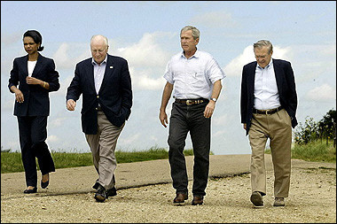

# Introduction
### Goal for Today

1. *Conceptualize and reconceptualize the essential character of international politics.*
2. *Discuss significant shortcomings in standard IR paradigms.*
3. *Build toward a better "strategic" understanding of international relations.*

### Motivating Puzzle

Does it matter at all what happens *inside* states if we want to understand what happens *between* them?

- Russell and Wright (1933) argue that it does.

However, it was never obvious that it matters.

- We assume **states** have **national interests**.
- States are **unitary actors** and the unit of analysis.

This line of thinking has pervaded much of IR theory through history.

# A Brief Review of Structural Theories
## The "-isms"
### Neorealism

We'll discuss neorealism in greater detail later, but here are some core assumptions (via Mearsheimer [2001]).

1. The international system is anarchic.
2. States are rational/strategic actors.
3. States are motivated to *survive*, not acquire power (per se).
4. All states possess some type of offensive military capability.
5. States can never be 100% certain of other state's intentions.

### Implications of Neorealism

We can see how these assumptions purport to illustrate an answer to the motivating puzzle.

- What happens inside states is irrelevant.
- States are the unit of analysis.
- All behavior is a response to the distribution of power.

Neorealists contend no state should strive to go the way of Poland in 1795.

### Liberalism

Liberalism doesn't diverge too far from neorealism, though tries to explain non-trivial cooperation.

- Realists argue that all cooperation is trivial and cynical.

Core assumptions/topics:

- Hierarchies emerge that can enforce contracts.
- States sometimes care about absolute, not relative gains.
- Regimes emerge to coordinate/promote shared interests.

Liberal scholars use game theory to illustrate coordination problems.

- The international system may be as much a stag hunt than a prisoner's dilemma.

### Constructivism

Constructivism cares more about the effects of ideas and norms than material interests.

- Emerged as an effort to explain "identity", which they argue is prior to preferences.

Core assumptions/topics:

- Leaders are less motivated by strategy and more motivated by a pursuit of legitimacy.
- Persuasion and "peer pressure" of sorts are as important as coercion and threats.

## A Brief History of IR Thinking
### A Brief History of IR Thinking

Modern-day liberal theories precede current realist formulations.

- Emerged as a function of Wilsonian idealism after WWI.

Realist theories emerge in the 1930s.

- Motivated especially by German theorists and ex-pats.
- Drew attention to failures of League of Nations, ongoing European arms races, and imperial ambitions of Germany, Italy, Japan.

### A Brief History of IR Thinking

Realist paradigms date to the 1930s (at the earliest), but the Treaty of Westphalia (1648) is its formative event.

- Ended the Thirty Years War
- Created sovereign state as we know it.
- Greatly restricted power of the Catholic Church.

### Territoriality and "the State"

The Treaty of Westphalia solidified territory and borders as an organizational concept in Europe.

- Even today, territory is an underlying issue in international conflict.

This has several implications:

- Borders defined a domain in which the ruler has monopoly of force (see: Article 67).
- International law, norms treat states as legally equivalent entities.
- Facilitates the emergence of the state as "unitary actor".
- Meshed well with rise of monarchical absolutism (i.e. "l'etat cest moi") and, later, totalitarianism.

## Shortcomings of Neorealist Worldviews
### Shortcomings of Neorealist Worldviews

This is not without numerous conceptual and empirical shortcomings.

- False equivalence of absolutism and the state masks considerable institutional differences between states.
- Serves as a poor guide to understanding policy differences within states over time.
- Conceptual unsoundness and logical inconsistency leads to poor predictions and, thus, poor policy.

### Neorealism and the Problem of the Iraq War

The Iraq War highlights shortcomings of neorealist thinking.

### Neorealism and the Problem of the Iraq War

Those who pursued the Iraq War were neorealists.

- Condoleeza Rice even has a Ph.D. in its study.
- Dick Cheney was a one-time Ph.D. student in political science as well.

The war itself was a neorealist war, even if most neorealists in the academy were against it.

- The U.S. was convinced its military might could coerce policy concessions from a post-Saddam Iraq.
- Instead, much of Bush's demands went unsatisfied.

Why would this happen in a world where the U.S. could quickly eliminate Iraq from the international system?

### The Problem of Leader Incentives and Strategy

Iraq's leaders were more sensitive to threats from Iraq's various factions.

- Shi'a clerics Muqtada al-Sadr and Ali Sistani were greater threats to Jalal Talabani than the U.S.
- Talabani was more sensitive to street violence waged by Iraq's factions than U.S. external threats.

Most of the policies advocated by Bush during this time would've been beneficial to most Iraqis.

- These include: Shi'a-Sunni reconciliation, Kurdish rights, and equal distribution of oil revenues.
- However, it would've compromised job security for Talabani.

Keeping Muqtada al-Sadr happy was more important than keeping George W. Bush happy.

### The Case of Afghanistan

A similar puzzle: why did the recent Afghanistan war happen?

- We forget that Bush gave the Taliban an "out".
- If the Taliban handed over bin Laden, war may not have happened.

So why did Afghanistan put state security on the line?

- Answer: handing over bin Laden would've been institutional suicide for the Taliban.
- Taliban needed support of Al-Qaeda to continue its regime.

Given a poor choice set, the Taliban was left to dare the U.S. to follow through on its threat.

# Implication and Conclusion
### Implication and Conclusion

All these shortcomings follow a major flaw in neorealist assumptions.

- There is no "unitary actor".
- We cannot "black box" the state.
- We often observe external threat as secondary to domestic pressures.
- We need to understand how leaders pursue ends, given these considerations of external rivals and domestic rivals.

*Domestic politics matter to understanding international politics*.

- We'll flesh this out more in the next couple lectures.
