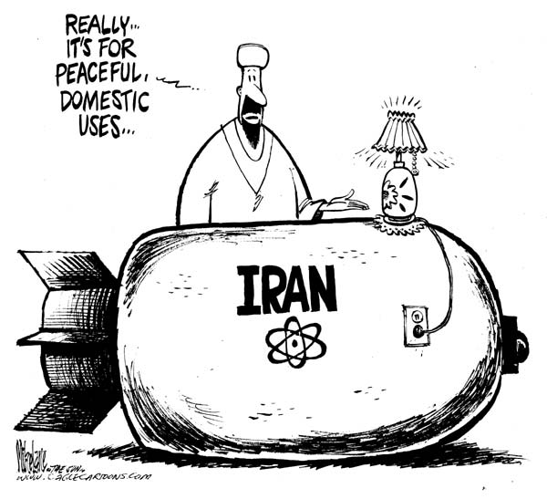

# Introduction
### Goal for Today

1. *Discuss the ongoing foreign policy case of Iran's nuclear program.*
2. *Introduce median voter theorem.*

# The Ongoing Case of Iran's Nuclear Program
## Background Information
### The Ongoing Case of Iran's Nuclear Program

### The Ongoing Case of Iran's Nuclear Program

Iran's pursuit of uranium enrichment is an ongoing case of interest.

- Iran: purports to want its own nuclear *energy* industry.
- The rest of the world: suspects Iran wants a nuclear weapon.

Iran's official story makes sense.

- Iran's economy depends on selling oil, not consuming it.
- Oil is strictly rationed in Iran, decreasing the citizens' quality of life.
- Almost everyone in Iran supports a nuclear program, albeit for different reasons.

### Skepticism of Iran's Intentions

Iran's official story rings hollow in the region and especially with the great powers.

- Uranium is not necessary for nuclear energy but it's necessary for a bomb.
- Iran has bountiful natural gas reserves it's not exploring.
- Russia's offer to enrich uranium on behalf of Iran was rejected.

A nuclear Iran would be difficult to coerce into being a good neighbor.

- Israel also fears an attack.

### Operation Opera 2: Electric Boogaloo?

Israel has privately toyed with the idea of duplicating its successful Osirak bombing mission against Iran.

### The Difficulty of a Second Operation Opera

### Further Logistical Difficulties

There are several logistical hurdles that make this a difficult operation.

- Israel's air force doesn't have many long-range aircraft.
- Would have to violate Jordanian, Iraqi, and Saudi airspace.
- The U.S. may quietly approve, but absolutely will not help.
- Reprisal on Iran's Jewish population may follow.
- May only *delay* Iran's program, and certainly invite retaliation.

### Should Israel Just Accept a Nuclear Iran?

## Sadr's Argument
### Sadr's Argument

Israel has three primary (and more secondary) concerns about a nuclear Iran.

1. Iran would launch a nuclear attack against Israel.
2. Iran would transfer nuclear weapons to Hezbollah.
3. Iran would be emboldened to attack Israel through conventional means, without fear of retaliation.

Sadr argues that these fears are mostly overblown.

- Iran is more pragmatic than popular discourse suggests.

### Would Iran Initiate Nuclear War Against Israel?

Two scenarios for a direct Iranian nuclear attack against Israel:

1. Iran rejects M.A.D. and is highly motivated to attack Israel.
2. A fanatical "rogue" element in Khameini's regime could seize power.

We haven't seen anything like this in South Asia, though.

- India went nuclear in 1974; Pakistan in 1998.
- Nuclear proliferation hasn't had any material effect on relations between these two rivals.

### Dismissing Concerns of a Direct Attack

1. Iran rejects M.A.D. and is highly motivated to attack Israel.

	- Doctrine follows weapons, not the other way around.
	- M.A.D. isn't exactly a nuanced concept.
	- Iran's nuclear bluster is more fiction than fact.
	- Past behavior is more informative than public statements.
	- An attack on Israel would likely damage Jerusalem. 
2. A fanatical "rogue" element in Khameini's regime could seize power.

	- *Dr. Strangelove* is a movie...
	- This scenario is *less likely* in Iran than other states
	- If anything, Iran's "rogue" faction is comprised of moderates.

### Dismissing Other Primary Concerns

2. Iran would transfer nuclear weapons to Hezbollah.

	- Hezbollah has distanced itself from Iran of late.
	- Iran would simply be repeating Khrushchev's errors (re: China).
	- Iran knows it would be held responsible in this scenario.

3. Iran would be emboldened to attack Israel through conventional means.

	- Nothing of post-revolution Iran suggests it cares about Israeli retaliation.
	- Resource constraints and other priorities limit Iran's militarization.
	- If anything, Iran might be more tame with nuclear weapons.

### Israel's Secondary Concerns

Israel has additional concerns beyond fear of direct attack.

1. Foreign-imposed regime change is off the table as a strategy.
2. Iran's domestic legitimacy would be enhanced.
3. Iran would be empowered to pursue regional hegemony.
4. A nuclear Iran might prompt a costly arms race for Israel.

### Dismissing Secondary Concerns

While important, these secondary concerns are exaggerated.

- Israel couldn't count on the U.S. for regime change anyway.
- If anything, nuclear weapons may de-radicalize the regime.
- A boost in popularity for clerics would be ephemeral.
- Nuclear weapons alone don't enhance international prestige.
- No reason to believe regional hegemony would trample Israel.
- An arms race would be in the distant future.

### The Central Takeaway

Israel has few reasons to fear a nuclear Iran, **but it has plenty of reasons to not like it**.

- Same goes for the U.S. and the other foreign policy actors involved.

Put another way, what's more important is the rest of the world does not want a nuclear Iran and has means to stop it.

# Median Voter Theorem

### Formally Understanding the Issue

How can we understand the strategic problem here for everyone involved?

### Answering our Puzzles with Modeling

We can use median voter theorem to predict outcomes when choices are unidimensional and preferences are single-peaked.

### Median Voter Theorem

**Median voter theorem** tells us that a majority rule voting system will select the outcome most preferred by the median voter (i.e. the voter in the middle).

- Applications include everything from presidential elections to the price of gasoline in your neighborhood.

### A Representation of Median Voter Theorem

Who wins in this vote? *A* or *B*?

### A Representation of Median Voter Theorem

*A* wins because *A* attracts the median voter.

### A Representation of Median Voter Theorem

This is the implication, as you might have guessed...

### The Race to the Middle

Ever wonder why presidential candidates sound identical at times?

- Don't blame me; I voted for Robot Nixon.

### Assumptions of Median Voter Theorem

Even in a "voting system" without actual voting, the ideal point of the median voter beats every other choice (with very few conditions).

1. Unidimensionality
	- The issue can be displayed on a straight line.
	- Each participant has a most preferred outcome (ideal point).
2. Single-peaked preferences
	- The farther a choice is from an individuals ideal point, the less valued is that choice.
3. Majority rule
	- The position favored by a majority of players wins.
	- Hence: the importance of the median (i.e. middle-most) "voter".

### Unidimensionality

All meaningful positions about Iran's nuclear potential can be displayed on a single line.

### Unidimensionality

### Single-peaked Preferences

### Preferences that are not Single-peaked

### Arraying Four Key Groups of Stakeholders

"None" is the mode. Is it also the median?

### Finding the Median Voter

Well, no.

### How Does This Relate to the 2015 Framework?

The discussion here is a bit dated, but insights are still relevant.

- Iran would cut the number of centrifuges (about 19,000) to about 6,000.
- The deal would limit uranium enrichment to just 3.67%-grade for 15 years, well below what is required for a bomb.

Notice: foreign actors (esp. the U.S.) still hold most of the cards but it can't get 100% of what it wants.

- In other words: the U.S.' position isn't the median.

# Conclusion
### Conclusion

What's important for understanding the Iran issue: foreign actors have plenty of reason to not like Iran, but no real reason to fear it.

- We can understand this strategic situation with reference to median voter theorem.

However, this theorem works only when the assumptions are met.

- Next lecture will show how the unidimensionality assumption is violated in the ongoing case.
