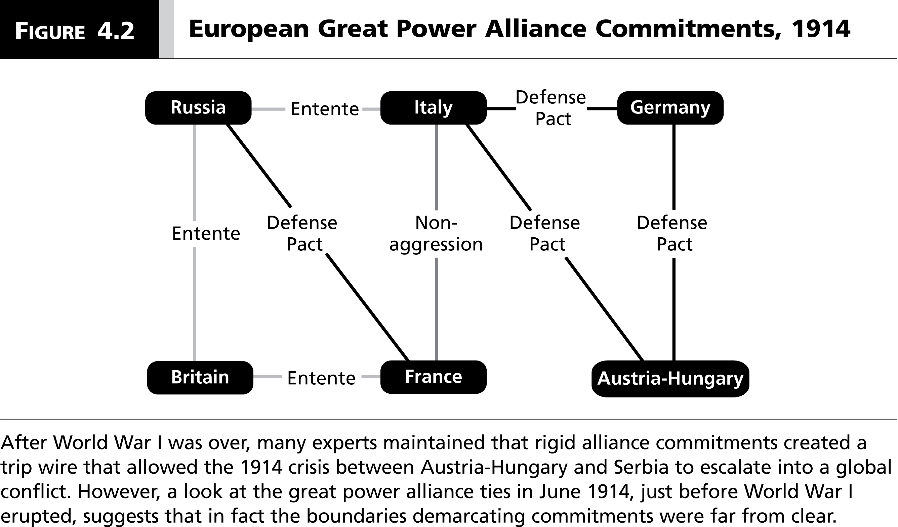
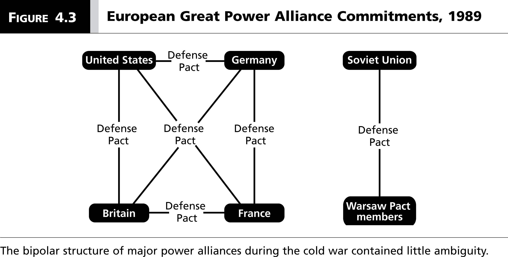
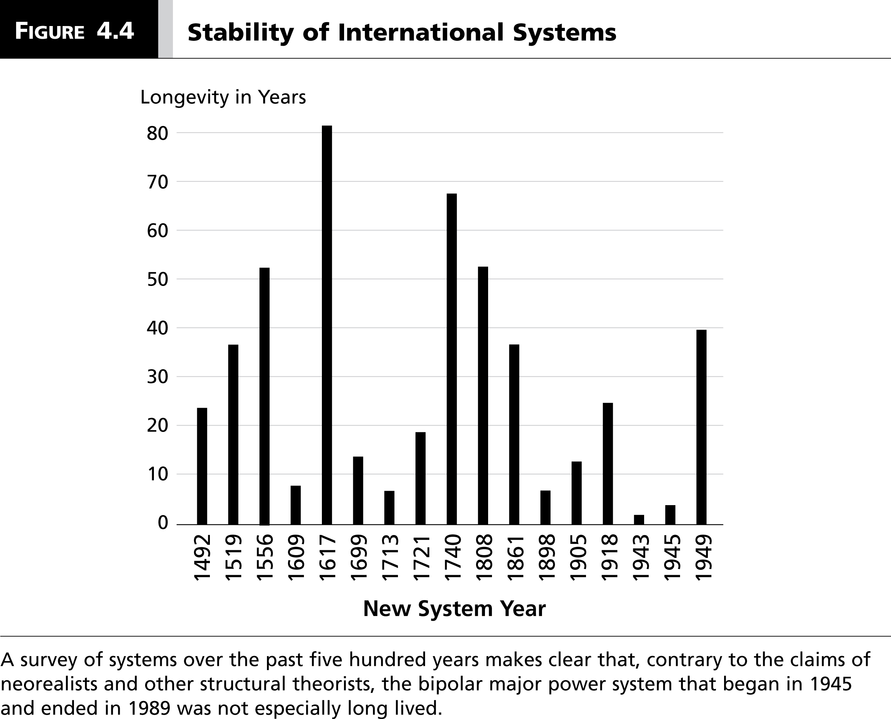
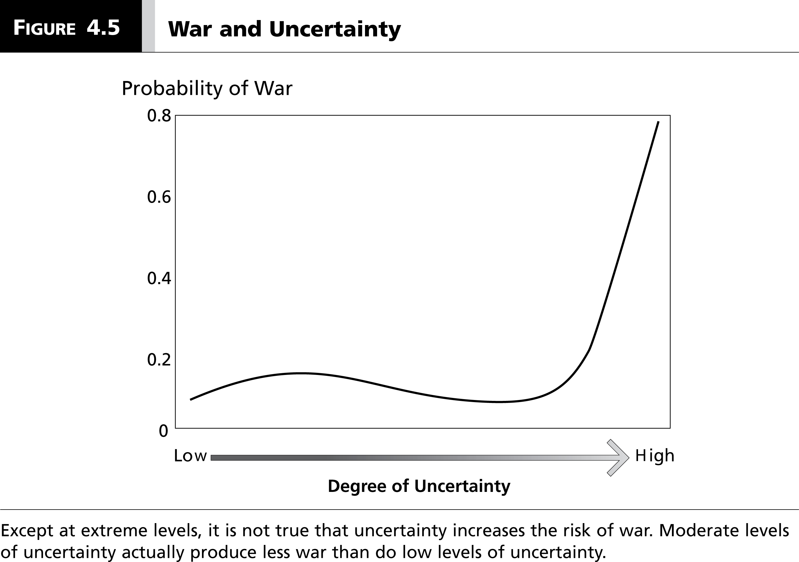

# Introduction
### Goal for Today

*Discuss neorealism (and everything that's wrong with it).*

### Classical Realism

Drawn from Hans Morgenthau's *Politics Among Nations*.

- Heavily inspired by Thomas Hobbes' *Leviathan*.
	- Anarchy reduces "Man" to his "nature".
- The state, *viz*, "Man" is hardwired to will for power.
- End result: bellum omnium contra omnes (war of all against all)

The state (i.e. "Man") pursues power to dominate his rivals.

- Nothing can be done to avoid this.

# Neorealism
## Neorealism's Main Components
### Neorealism

Neorealism (aka "structural realism") remains the most prominent, powerful approach in security studies. The argument, in a nutshell:

- The *structure* of the international system, not "human nature", forces states to pursue power.
- Anarchy has a single logic that forces a state to see means to protect itself.
- Power is the *means*, not the end.

### Neorealism's Assumptions

Neorealism is built on a few core assumptions (think: parsimony).

1. The international system is anarchic.
2. All states possess some type of offensive military capability.
3. States can never be 100% certain of other state's offensive intentions.
4. States are motivated to *survive*.
5. States are rational/strategic actors.

These assumptions differ slightly from what your book presents.

- They actually come from Mearsheimer (2001).
- Most neorealist scholarship has done a poor job outlining its assumptions, as we shall see.

### Neorealism's Main Conclusions

All told, these assumptions imply states seek a **balance of power** in the international system.

- States eventually fear each other.
- This fear can never be inconsequential.
- International politics becomes a self-help world under anarchy.
- Power becomes the means to security.

Power-seeking leads to the famous problem of the **security dilemma**.

### Neorealism's Hypotheses

Several hypotheses follow these arguments.

- Bipolar systems are more stable than multipolar systems.
- States engage in balancing behavior, such that power distributions converge on a balance.
- States mimic, or echo, one another's behavior.

As we will see, these explanations are flawed in multiple ways.

- The assumptions do not logically imply the hypotheses.
- The empirical record does not vindicate the hypotheses.

## Bipolarity and Stability
### Bipolarity and Stability

Polarity constitutes possibly *the* core argument of neorealism:

- Bipolarity: peace
- Multipolarity: war

International system was multipolar before the Cold War

- The period saw multiple systemic wars dating back to 1648.
- Cold War was only point in history in which the two largest powers did not (directly) fight each other.

### An Example of Multipolarity

### An Example of Bipolarity

### The Hypotheses Do Not Follow the Assumptions

By itself, neorealism's assumptions do not imply the relationship between polarity and stability.

- i.e. "certainty" may embolden risk-taking, "uncertainty" may foster risk-aversion.
- We'd have to add another assumption: all states are equally risk-averse in the face of certainty.

If we relax this even a little bit, we've violated core assumptions of neorealism.

- Violates the unitary actor assumption
- Reduces hypothesized effect of polarity on stability to zero.
- States no longer mimic each other.

### The Polarity-Stability Relationship

Consider a world with A and B in which there are 300 units of "power".

- A: 150
- B: 150

Such a bipolar system would be stable.

- Neither A nor B could destroy each other.

### The Polarity-Stability Relationship

Consider a different world with A and B with 300 units of power.

- A: 151
- B: 149

Neorealism assumes this should be stable, but A could destroy B.

- Only when power is perfectly balanced does bipolarity produce peace.

Objection: power is balanced "enough".

- However, this would deny neorealism's own claim. Bipolarity is supposed to reduce uncertainty!

### The Polarity-Stability Relationship

Consider a five-country system as follows (with 300 units of power).

- A: 75
- B: 74
- C: 75
- D: 74
- E: 2

System 1 is **stable**.

- No one can be eliminated, not even E.

### The Polarity-Stability Relationship

Consider another five-country system:

- A: 78
- B: 74
- C: 73
- D: 73
- E: 2

This system is **unstable**. E is an **inessential actor**.

### The Polarity-Stability Relationship

However, that doesn't mean multipolarity is unstable?

- A could destroy E by itself.
- B, C, and/or D could approach A with a deal to facilitate the elimination of E.

A new system: A (150), B (39), C (38), and D (73).

- This is another stable multipolar system.
- B-C-D is a **blocking coalition**.

### Bipolarity, Uncertainty, and Stability

Can we salvage the bipolarity-stability argument if we relax the "uncertainty" claim?

- After all, our simple example may not do justice to understanding the real world.

Assume A thinks there's chance *p* it could eliminate B.

- *p* = A's resources/(B's resources + A's resources)

A does not attack B if:

\[ p(U_{AW}) + (1 - p)(U_{AL}) < U_{ASQ} \]

...where $U_{AW}$ = utility for A winning and $U_{AL}$ = utility for A losing.

### Bipolarity, Uncertainty, and Stability

Assume $U_{AW}$ = 1 and $U_{AL}$ = 0. When would A attack B?

\begin{eqnarray}
p(U_{AW}) + (1 - p)(U_{AL}) &>& U_{ASQ}   \nonumber \\
pU_{AW} + U_{AL} - pU_{AL}  &>& U_{ASQ} \nonumber \\
pU_{AW}  - pU_{AL}  &>& U_{ASQ} - U_{AL} \nonumber \\
p   &>& \frac{U_{ASQ} - U_{AL}}{U_{AW}  - U_{AL}} \nonumber \\
p   &>& \frac{U_{ASQ} - 0}{1 - 0} \nonumber \\
p  &>& U_{ASQ} \nonumber
\end{eqnarray}

A attacks B if the probability of winning is greater than A's utility of the status quo.

### Bipolarity, Uncertainty, and Stability

Assume a world of 300 units of power.

- A: 60
- B: 240

When would A attack B?

- $p = \frac{60}{60+240} = .2$
- If A is really dissatisfied with the status quo (i.e. $U_{ASQ} < .2$), it'll attack B.

This is intuitive but it violates a neorealist assumption of security-oriented behavior!

### Is There Anything Special about Bipolarity?

## Other Neorealist Predictions
### Essential and Inessential States

1. Essential states never become inessential.
2. Essential states are never eliminated from the international system.
	- Square this with USSR, Austria-Hungary, Ottoman Empire.
3. Inessential states never become essential states.
4. Inessential states are always eliminated from the international system.	
	- Square this with the United States.

### Does Uncertainty Increase War?

# Conclusion
### Conclusion

Neorealism purports to be a parsimonious explanation of international politics.

- It's also the most common approach in security studies.

However, neorealism suffers from major flaws.

- The assumptions do not imply the hypotheses.
- The hypotheses, however derived, are not supported by the empirical record.

Neorealism is both a false and useless paradigm to explaining international relations.

