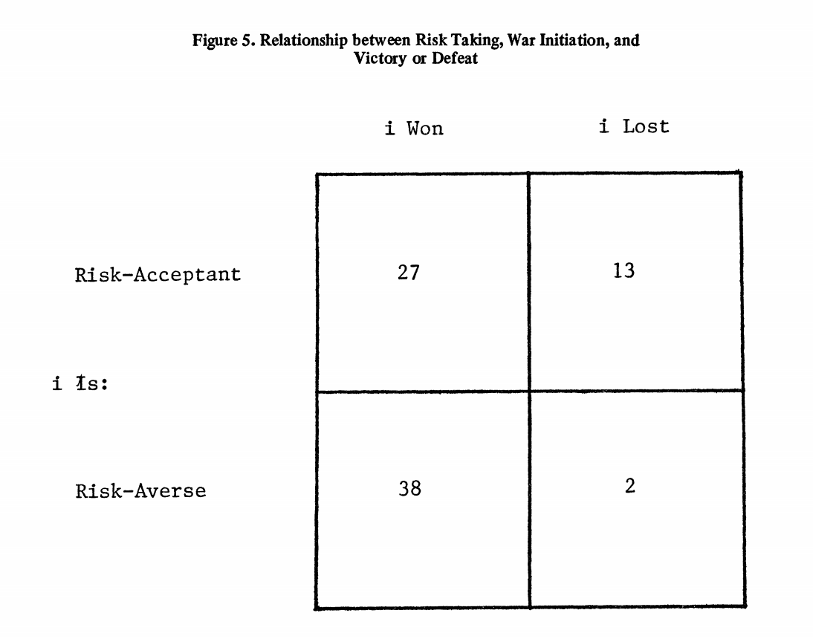
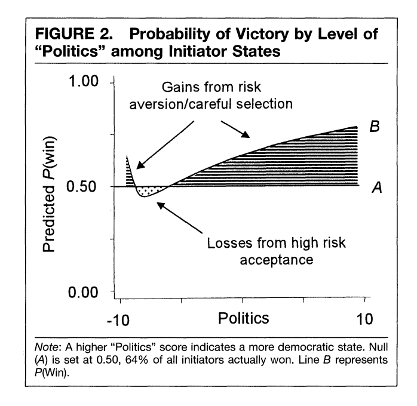
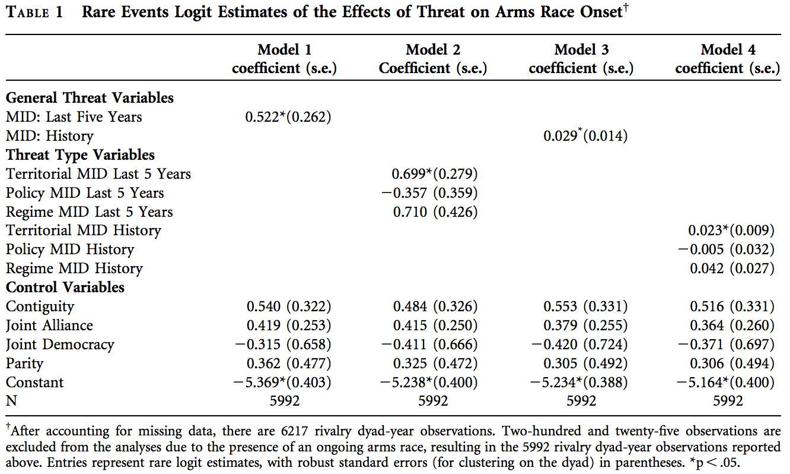
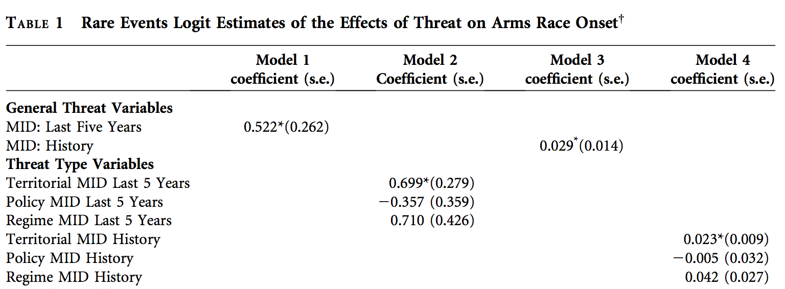

# Introduction
### Goal for Today

1. *Discuss the utility of case studies, and how **not** to do them*.
2. *Introduce students to some basic statistical inference*.

### Theories

Theories are explanations of some observed phenomena.

- Distinguishable from hypotheses, and facts.
- Simplifications of reality.
 	- Inherently "wrong", but ideally useful.
- Comprised of assumptions, logic, and predictions.
- Evaluated by their consistency, parsimony, usefulness, and predictions relative to competitors.

# Scientific Method
### Testing the Predictions

We judge a theory's usefulness by its predictions, but how?

1. Case study method
2. Large-*N* "controlled" experiments

## Case Study Method
### Case Study Method

We can test theories through a careful scrutiny of a particular event, or a **case study**.

- We sometimes call this a "qualitative" approach.

This is inviting for students and scholars, but it's easy to do this poorly.

- "Don't select on the dependent variable"
- Don't cherry-pick cases a priori consistent with a theory.
- Don't test theories with observations that *informed* the theory.

These are all important, though they may not be obvious.

### Problems of Inference

Assume we want to know whether arms races lead to war. We have these three strategies.

1. We select the major wars in Europe since 1816 (using CoW data).
    
    - i.e. everything in Europe from the Franco-Spanish War (1823) to WWII (1945)
    
2. We analyze WWI and WWII.
3. We look at the Anglo-German arms race before WWI.

What's wrong with these research designs?

### Problems of Inference

None of these are valid research designs.

- The first selects on the dependent variable.

    - We must also account for how arms races may not lead to war (e.g. Cold War)
    - Some wars are *not* preceded by an arms race, but that doesn't save this research design.

- The second selects on the DV and cherry-picks consistent cases.
- The third selects on the DV, cherry-picks a consistent case, and uses an observation that informed the theory of the war-proneness of an arms race.

    - The Anglo-German naval arms race is a conspicuous event in this scholarship.
    - Nothing new is ultimately predicted.
    
### The Utility of Case Studies

So what can case studies do?

- They can support or refute unambiguous claims of necessary and/or sufficient conditions.

Recall: 

- **Necessary conditions**: if not-A, then not-B.
- **Sufficient conditions**: if A, then B.
- **Necessary and sufficient**: if A, then B *and* if not-A, then not-B.

### Necessary Condition

| A?  | B    | not-B |
|-----|------|-------|
| Yes | 10   |  10   |
| No  | 0    |  20   |

Necessary condition: A must be present for B to occur.

### Sufficient Condition

| A?  | B    | not-B |
|-----|------|-------|
| Yes | 20   |  0    |
| No  | 10   |  20   |

Sufficient condition: A guarantees B, even if B can happen in A's absence.

### Necessary and Sufficient Condition

| A?  | B    | not-B |
|-----|------|-------|
| Yes | 20   |  0    |
| No  |  0   |  20   |

Necessary and sufficient condition: A guarantees B and B cannot occur without A.

### Neither Necessary nor Sufficient

### Some Necessary and/or Sufficient Claims

Most arguments are probabilistic, though there are some examples or necessary/sufficient claims.

- Bueno de Mesquita (1981): positive expected utility is a necessary condition for war initiation.
- Goertz and Diehl (1995): "political shock" is necessary for rivalry onset or termination.
- Russett (1995): joint democracy is a sufficient condition for war avoidance.
- Schweller (1992): power transitions with declining democratic leader is necessary and sufficient for absence of preventative war.

## Large-N "Controlled" Experiments
### Large-N as Means to Generalization

Case studies help us make limited claims of predictive (in)consistency, but are not great for generalization.

- This is because most claims are probabilistic.

Some common probabilistic claims assume form of these hypothesized relationships.

- *Positive relationship*: as X goes up, Y goes up (and vice-versa)
- *Negative relationship*: as X goes up, Y goes down (and vice-versa)
- *Curvilinear relationship*: as X goes up, Y goes up until some point. Then, Y goes down as X continues to go up (and vice-versa).

### An Example of a Curvilinear Relationship

### A (Regrettably) Brief Statement of this Approach

- Larger-n will allow us to generalize across more cases.
- Will also allow for statistics to assess effect size
- If sample is representative of population, difference between sample and population is just random.

    - This exact same logic is used by polling services for elecctions.
    
The tools we use  (i.e. regression) can be more precise and informative than case studies.

- That said, it will require careful interpretation of a regression table.

### An Example Using Rider (2009)

Rider (2009) wants to explain arms race onset.

 - We already know arms races usually lead to war.
 - However, we don't know why states arms race if a costly war is likely to follow.
 
Rider argues that rivals will engage in arms race when they threaten each other over other issues.

 - Hypothesis 1: rivals experiencing a general threat are likely to arms race
 - Hypothesis 2: rivals experiencing a threat to their territory are likely to arms race.
 
### An Example of a Regression in IR

### Evaluating a Regression Analysis

I mention there are three things to do when evaluating a regression analysis.

1. Know (however, general) the data used.
2. Know what the objects in the regression table are saying.
3. Know what the regression table *isn't* saying.

### Rider's (2009) Data

The first step is to know what the variables used are supposed to capture.

- Dependent variable: onset of an arms race (Y/N)
- Independent variable:

    - "General threat": MID in the past five years (and total history)
    - "Territorial threat": MID over territory in past five years (and total history)
    
- Control variables: contiguity, joint alliance, joint democracy, power parity

### Interpreting the Regression Output

Find the following objects in the regression table:

1. The numbers in parentheses
2. The numbers *not* in parentheses
3. The asterisks that appear next to some numbers.

### Interpreting the Regression Output

1. The numbers in parentheses

    - These are the **standard errors**.
    - They communicate prediction error.
    - However, their interpretation depends on the associated numbers not in parentheses.

2. The numbers *not* in parentheses

    - These are the **regression coefficients**.
    - They communicate the estimated change in the DV for a unit-change in the IV.
    - Determine if it's positive or negative (recall: relationships).
    - However, their substantive interpretation depends on the presence/absence of asterisks.

3. The asterisks that appear next to some numbers.

    - These communicate the **statistical significance**.
    - i.e. is the estimated positive/negative effect discernible from zero?
    - If so, we say that the IV has a "significant" (i.e. highly unlikely to be zero) effect on the DV.
    
### Careful Interpretation of Significance

### Careful Interpretation of Significance

We conclude the results are *consistent with* Hypothesis 1 and 2.

- Rivals experiencing a general threat are likely to arms race.
- Rivals experiencing a territorial threat are likely to arms race.
- Both are examples of positive relationships.

### Careful Interpretation of Significance

Notice the process looks similar to a deductive approach.

- i.e. if H is true, then the parameter estimates for X1 will be statistically significant.
	- alternatively, and more formally: if the hypothesis is true, the test statistic will be drawn from a probability distribution that matches the population parameter.
- If X1 is statistically significant, we "fail to reject the hypothesis".
	- We don't "prove" the hypothesis or "accept" it. It just lives to be refuted another day.
- If X1 is not significant, we reject the hypothesis.
	- This is akin to denying the consequent.

### Some Cautions about the Regression Table

Regression Tables shouldn't be daunting, but they can be misleading.

- Mind the distribution of the DV.
- Don't mistake "significant" for "large" or "very important"

    - For now, just look for significance to assess non-zero positive or negative effects.
- The constant is our estimate of Y when all Xs are zero.

    - It's not terribly important for beginners learning to evaluate regressions in political science.

# Conclusion
### Conclusion

Didn't think you'd get this in a political science class?

- It's not intuitive, but it's important to learn this stuff.

Generally, we have two means to test the predictions from our theory.

- Case studies have limited, albeit sometimes important, utility.
- Statistical analysis (with large-N) gives us estimates of cause-and-effect, but require careful interpretation.

