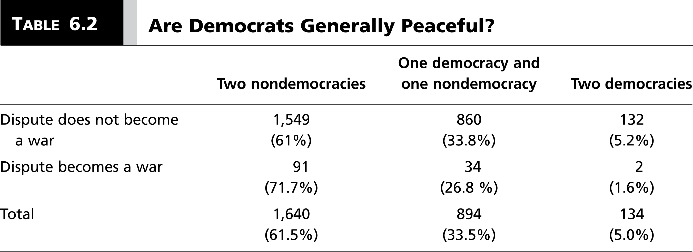
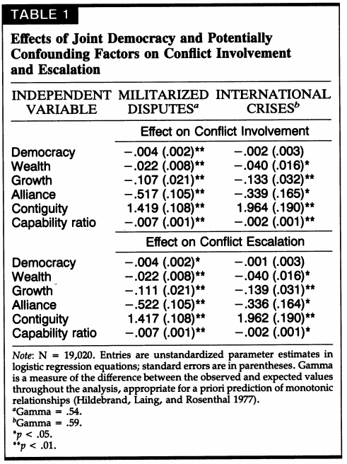
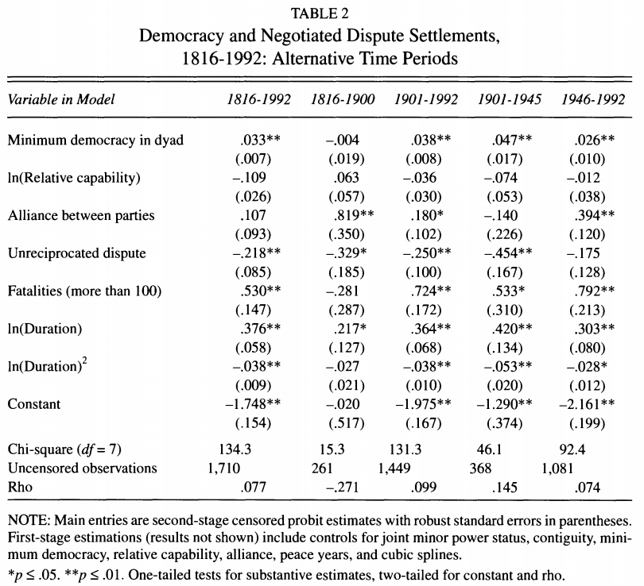

# Introduction
### Goal for Today

1. Discuss the democratic peace findings.
2. Discuss the democratic peace *theory* (or theories)
3. Offer the author's selectorate peace to explain these findings.

# Democratic Peace Theory
## Democratic Peace Findings
### Democratic Peace Theory

Democratic peace theory (DPT) may be the most important finding in IR scholarship.

- Originally discovered by Babst (1964), later confirmed by a skeptical Singer and Small (1976).
- Has important, if ad hoc, theoretical origins in Kant (1795).
- Levy (1988): closest thing to an empirical law in all political science.

### Democratic Peace Fact or Theory?

DPT is actually a bit of a misnomer.

- It's a democratic peace *fact*. It *needs* a theory.
- In many ways, this is still true.

### Core Democratic Peace Findings

There are two core findings to democratic peace theory.

1. Democracies have never fought each other in a war.
	- Note: Maoz and Russett (1993) mostly tackle this aspect.
2. Democracies are still as war-prone as other state types.
	- Note: Rousseau et al. (1996) attempt to vindicate the "monadic" hypothesis.

### Additional Democratic Peace Findings

All told, DPT findings cluster into peculiar aspects of democracies in IR.

1. Democratic war avoidance
2. Democratic war behavior

### Democratic War Avoidance

1. Democracies do not fight wars against each other.
2. Mature democracies avoid war with each other.
	- Conversely, democra*tizing* states are war-prone.
3. Democracies conclude their disputes before war with negotiation .
    - This concerns the Dixon (1994) article.
4. Major power democracies are more peaceful.
	- I've long wondered if this is peculiar to the Morgan and Campbell (1991) study.

### Democratic War Behavior

1. Democracies are as war-prone as non-democracies.
2. Democracies win the wars they fight.
3. Democracies fight shorter wars.
4. Democracies are as likely as non-democracies to target weak rivals.
5. Democracies are more likely to initiate war against autocracies, and not the other way around.
6. Democracies incur fewer battle deaths in the wars they do initiate.

### Some Findings

### Maoz and Russett (1993)

### Dixon and Senese (2002)

### A Quick Interpretation

Table 6-2 (from the book).

- Only two wars observed since 1816 between two mature democracies.
- Even then, Pakistan was regressing toward military rule in 1993.
- Turkey was anything but democratically stable in 1974.

### A Quick Comprehension Check

Maoz and Russett (1993, Table 1):

- Higher levels of *joint* democracy, the less likely two states enter into a MID or crisis.
	- The effect is statistically significant (notice the "stars").
	- In other words, it is highly unlikely the true effect is zero.
- Higher levels of *joint* democracy, the less likely an ongoing MID or crisis escalates to war.
	- This effect is also statistically significant.

### A Quick Comprehension Check

Dixon and Senese (2002, Table 2):

- The higher the level of *the minimum democracy score* in a dyad, the more likely a dispute ends in negotiation.
	- This "minimum democracy score" specification is known as the "weak-link specification" in DPT.
- However, the only period we don't observe this is in the 19th century.
	- Democracies were scarce and there are just 261 overall observations in that model.

## Democratic Peace Theories (or Perspectives)
### Democratic Peace Theories (or Perspectives)

Arguments for DPT don't enjoy the same kind of consensus as the basic findings.

1. Structural (or institutional) perspective
2. Normative perspective

### Structural Perspective

We'll use Maoz and Russett's two assumptions.

1. Dangerous foreign policy dilemmas require mobilization of support in democracies to lead to war.
2. Only "emergencies" can circumvent the mobilization process.

Argument:

- Protracted mobilization makes it difficult for democrat to "sell" war at home.
- The longer this takes for two democracies, the more time for cooler heads to prevail.
- However, autocracies do not have this lengthy mobilization process.
- Therefore, mixed pair disputes assume the form of an "emergency".

Thus: democracies avoid war with each other, but not other state types.

### Normative Perspective

We'll use Maoz and Russett's two assumptions (though Dixon [1994] has the best statement of this perspective).

1. States externalize their internal norms of conduct.
2. In mixed disputes, "norms" assume the form of the non-democracy.

Argument:

- Democrats trust that rival democrats share same "bounded" norms.
- No norms exist to restrain escalation between democrat and an autocrat.

Thus: democracies avoid war with each other, but not other state types.

### Problems with Institutions

Early institutional arguments suffer from a host of problems.

- Implicitly (and undeniably) assumes the monadic argument.
- Struggle with rally effects (see: Trent Affair and, especially, Spanish-American War).
- Still not obvious why major power democracies should be more constrained.
- Paints over heterogeneity of democratic institutions.

### Problems with Norms

Normative arguments aren't much of an improvement.

- Importantly: they beg the question.
- They also exist ad hoc.
- Struggle to explain things like covert operations.
- Really struggle with colonialism (see: Belgium and Congo).

# The Selectorate Peace
### The Selectorate Peace

The author offers a selectorate perspective. Assume:

- State leaders are the unit of analysis.
- State leaders all share same goal: to remain in power.
- State leaders distribute a combination of goods toward that end.
- The package varies by *W* and *S*.

We forget that foreign policy is a public policy.

- It's a public good (or bad) that leaders provide to all constituents.

### A Selectorate Crisis Model

Assume State A and State B are in early phases of dispute.

- Each leader has two options: fight or negotiate.
- If both choose negotiate, A returns *X* to constituents.
	- B returns the remainder (1 - *X*).

Thus, this crisis would end short of war.

### A Selectorate Crisis Model

If one chooses fight, *both* must choose a percentage of the state's overall resources (*R*) to dedicate to a fight.

- The author calls this the **war effort**.
- Allocation of all of *R* is a commitment to win.
- However, committing all of *R* comes expense at private goods that *W* wants (denoted as *R/W*).

### A Selectorate Crisis Model

If A or B wins the war, it gets a payoff of *V* = *v* + *r* for victory.

- *v*: the public good of victory.
- *r*: private goods of the losing state's resources (allocated as *r/W*).

### A Selectorate Crisis Model

Here's an important twist: state leaders can choose to fight and *not* "try hard".

- Trying hard means spending more *R* for pursuit of *V*.
- However, it comes at expense of private goods for *W*.

Assume two war strategies.

1. Go "all in" (spend *R* on war).
2. "Half-ass" it (keep *R* for *W*).

### A Selectorate Crisis Model

The state leader chooses to half-ass it when its utility for option two is greater than utility for one. Such that:

$$
R/W - k > v + (r/W) - k 
$$

*k* is a simple cost parameter, denoting the cost of war.

### Solving for *v*

Two values interest us here: *v* and *W*. Let's solve for *v*.

\begin{eqnarray}
R/W - k &>& v + (r/W) - k     \nonumber \\
R/W -k + k - r/W   &>& v \nonumber \\
(R - r)/W &>& v \nonumber
\end{eqnarray}

### Solving for *v*

In short, the state leader chooses to "half-ass" and hope for a "cheap buck" in war when $(R - r)/W > v$.

- It goes "all in" when value of public good of victory (*v*) is greater than $(R - r)/W$.

As *W* increases, the value of private rewards decrease.

- All else equal, large *W* incentivize state leaders to go "all in" for public good.

### The Selectorate Peace's Findings

1. Democracies (large *W/S*) do not fight wars against each other because they know the other side will go "all in".
	- Knowing that, they prefer negotiation.
2. Variations in *W/S* also capture war-prone democra*tizing* states.
3. Democracies win their wars because they dedicate more to the fight in pursuit of *v*.
4. They also pick easy fights too.

Democratic war behavior is explainable by strategic self-selection.

- Notice we said *nothing* about democratic values either.

# Conclusion
### Conclusion

DPT is most important finding in our field, but it's a frustrating topic.

- The findings precede the "theory" of DPT.
- Traditional perspectives tend to be invalid.
- The selectorate peace offers an improvement in our inferences.
