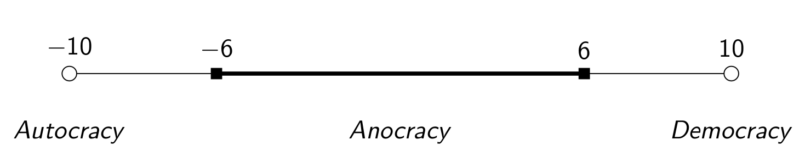

# Introduction
### Goal for Today

1. *Introduce students to selectorate theory.*
2. *Familiarize students with basic mathematical thinking.*

### A Puzzle: How Do We Explain This?

### Standard View of Regime Type, a la the Polity Project

# Introducing Selectorate Theory
### Bueno de Mesquita's Representation of State Type

The author sees states and state types differently.

- All states have citizens, the polity (*N*).
- The **selectorate** (*S*) is a subset of the citizens.
	- The selectorate has at least a nominal say in choosing the leader.
	- In the U.S. example, this is all eligible voters.
	- The disenfranchised = *N - S*.
- The **winning coalition** (*W*) is a subset of the selectorate.
	- The winning coalition is responsible for keeping the leader in power.
	- If the composition of *W* changes, the leader changes.
	- In democracies, *W* is typically 50%+1 of eligible voters.

### A Representation of Selectorate Theory

## Retaining Office
### Retaining Office

Recall our core assumption about leader incentives.

- So how do leaders do this?

Simple: providing goods.

- Leaders provide a combination of public/private goods for tenure.
- **Public goods**: nonexcludable, nonrivaled; everyone benefits from them.
- **Private goods**: excludable and rivalrous; only *W* gets them.

### Finding the Right Combination

All leaders of all political systems produce both public and private goods.

- The mix varies with selection institutions.

As *W* increases, the leader sees more value in providing public goods.

- Bribing a lot of people is rather expensive.

When *W* is small, the leader provides more private goods.

- It's why the Kim family can starve out 24-million people when only 9-250 people (basically: military elites) need private rewards.

### W/S: The Loyalty Norm

We can classify states by type depending on the ratio *W/S*.

- Size of winning coalition/size of selectorate.
- Assumption: *W* $\le$ *S*
- States with large *W/S* are what we would call democracies.

*W/S* is what the author calls a **loyalty norm**. It captures how loyal a *W* member is to the leader.

- Formally, it is the probability of being included in any future winning coalition.
- The smaller *W/S*, the *more* loyal the *W* member should be.

## When Does a W Member Remain Loyal?
### When Does a Winning Coalition Member Defect?

There is some math upcoming, so let's introduce some variables first:

- *x* = public goods; *g* = private goods
- *W* = winning coalition; *s* = selectorate
- *W/S* = loyalty norm (Assumption: *W* $\le$ *S*)
	- Formally: the probability of being included in a future winning coalition.
- $\delta$ = discount factor (Assumption: $0 \le \delta \le 1$)
	- This is a "discounted" payout over repeated trials of a game.
	- Important if a player prefers a payout now vs. a payout in the future.
	- Higher values of $\delta$ mean player cares more about future payouts.
- $\frac{1}{1 - \delta}$: standardized payout over infinity trials.
	- i.e. $1 + 1\delta + 1\delta^2 + 1\delta^3 + \ldots 1\delta^\infty = \frac{1}{1 - \delta}$

### When Does a Winning Coalition Member Defect?

This is a simple expected utility calculation.

\begin{equation}
    EU(W_i|Loyal) = \frac{1}{1 - \delta}(x + \frac{g}{W})
\end{equation}

\begin{equation}
    EU(W_i|Defect) = \frac{1}{1 - \delta}[\frac{W}{S}(x + \frac{g}{W}) + 1 - \frac{W}{S}(x)]
\end{equation}

*Very simply*: when does $W_i$ choose to defect?

- What else does $W_i$ consider in her decision to defect or remain loyal?

## An Illustration of W/S
### W/S: A Simple Illustration

Assume a leader has this system: $S$ = 1,000,000; $W$ = 100.

- The leader has $1 billion at her disposal to retain her office.

What could the leader do to retain office?

### W/S: A Simple Illustration

The leader could divide that pie: $10-million per *W* member.

- If *W* member ($W_i$) wants more, there's a .01% chance he could get a better deal and a 99.99% chance he gets nothing.
- i.e. *W/S* = $\frac{100}{1000000} = \frac{1}{10000} = .0001$

His expected utility for defection is $1,000.

- $EU(W_i| Defect) = .0001(1000000) + .9999(0) = 1000$

Should the leader just spend $10 million per *W* member and call it a day?

### W/S: A Simple Illustration

*Recall: this is a strategic problem*.

- The leader should see $W_i$'s strategic weakness.
	- i.e. $W_i$ is easily replaceable in a winning coalition.

If the leader offers every $W$ member at least as much as $W_i$ could gain on average from defection, she can secure her office.

- i.e. The leader retains tenure if $U(W_i | Loyal) \ge EU(W_i | Defect)$.

Thus, the leader offers every *W* member $1,000 and retains the rest for a slush fund.

### W/S: Another Illustration

Assume a leader has this system: *S* = 1,000,000; W = 500,001.

- The leader again has $1 billion at her disposal to retain her office.

What happens if the leader tries to divide the pie: $2,000 per *W* member?

### W/S: Another Illustration

If $W_i$ wants more, there's a 50% (rounded) chance he gets a better deal.

- Expected value for defection: $1,000

	- $EU(W_i | D) = .5(2000) + .5(0) = 1000$

- Doesn't seem appealing, does it?

Under these conditions, it is inexpensive for $W_i$ to support a challenger.

- It's also impractical to buy all *W* members with private rewards.
- Private rewards are spread more thinly and can less easily compensate failed *public* policies.

# Conclusion and Implications
### A New Way of Thinking about IR

Leaders do not benefit equally from peace and prosperity.

- Large *W*: good policy and low private goods improve survival.
	- Bad public policies aversely affect tenure.
	- Because *W/S* is large, the cost of defection is low.
- Small *W*: good policy is bad politics.
	- Best survival prospects: small *W/S* (defection is risky, costly).

The likelihood a leader survives in office despite failed policies increases as *W/S* decreases.

### Implications

Large-*W* leaders:

- High levels of cooperation
- Stable foreign relations
- Leader change has little effect

Relations with small-*W* leaders:

- Leaders care less about successful foreign policy (and public goods overall).
- Leader change leads to a new coalition and changes in policy, i.e. policy volatility.
	
