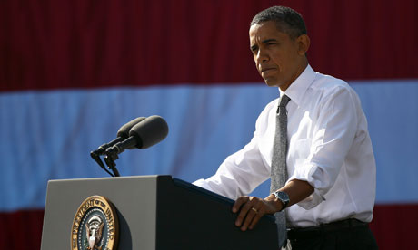
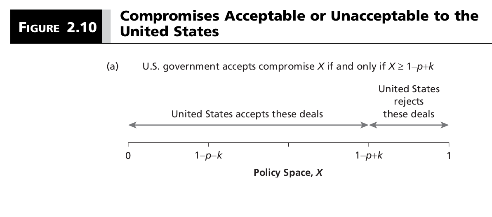
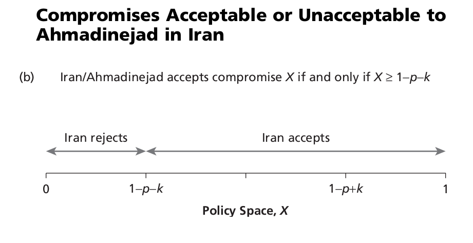
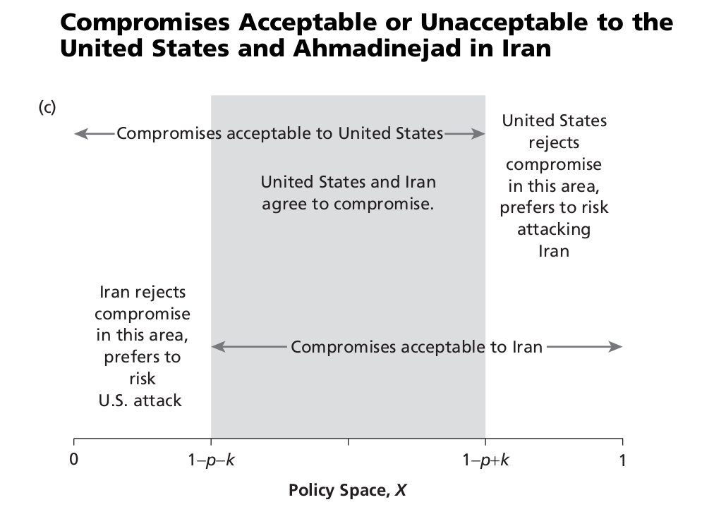

# Introduction
### Goal for Today

1. *Discuss the ongoing foreign policy case of Iran's nuclear program.*
2. *Introduce spatial modeling and expected utility theory.*

# The Ongoing Case of Iran's Nuclear Program
### Retention Check

1. Why does Iran's nuclear program make economic sense for Iran?
2. What are some exact reasons for skepticism from the rest of the world about Iran's intentions?
3. How feasible is a second "Operation Opera" for Israel in response to Iran's nuclear program?
4. What are Israel's three primary concerns about Iran's nuclear intentions?
5. What are some explanations for how unlikely each scenario is?
6. How credible/important are Israel's secondary concerns?
7. Overall, does the world have reason to "fear" a nuclear Iran?

# Spatial Modeling
### Median Voter Theorem

Median voter theorem can provide some insights into this strategic problem.

- Implications: anti-proliferation interests hold most of the "power", but are not the median position.
- Thus: we see the world powers pursuing a negotiated framework with Iran.

### Median Voter Theorem

Median voter theorem works great *only* when the assumptions are met.

- The unidimensionality assumption does not hold in this case.

The Iranian nuclear issue is a two-dimensional issue.

- How nuclear should Iran be?
- What combination of carrot and sticks is appropriate?

Here, we see a divergence between the preferences of the U.S. (under Bush) and Israel and Russia and Saudi Arabia.

- We also see a divergence in this year between the U.S. (under Obama) and Israel.

### Introducing Spatial Modeling

**Spatial modeling** is a class of formal theoretical perspectives that assume we can graph policy preferences from stakeholders in a Euclidean space that includes more than one dimension.

### Our Assumptions for this Application

Assumptions (for this pedagogical exercise):

- We will retain majority rule and single-peaked preferences.
- Ali Khameini has veto power over Iranian policy.
- Any new policy must be an improvement for Iran from the status quo.

	- Iran: Khameini + Ahmadinejad (now: Rouhani)
	
### Our Assumptions for this Application

Some more assumptions, just to clarify:

- *Players*: Egypt, Saudi Arabia, Russia, U.S., Israel, Ali Khameini, Mahmoud Ahmadinejad.

	- Recall: this application takes place circa 2007.

- *Status quo*: civilian energy industry + stiff sanctions from 2007.

### Graphing our "Voting" Blocs

### Finding Win Sets

Figure 2-6 shows us how far each bloc is willing to go to make a compromise it sees as an improvement from the *SQ*.

- It does *not* tell us which two-dimensional policy choices could be reached to change the *SQ*.

What's left to know?

- What are our **win sets** (i.e. a set of policies that can beat the point of comparison)?
- What are the **circular indifference curves** for everyone involved?

	- This is a set of policy choices for a stakeholder that are equally good or bad for the stakeholder when compared to the ideal point.
	
### Two Win Sets

### Two Win Sets

In the larger shaded area, non-U.S./Israel foreign interests reach a deal with Iran to facilitate a nuclear program (possibly into weapons research) in exchange for significant concessions.

- Problem: doesn't include the U.S., which could veto if it goes through the UNSC (and it would).

In the smaller shaded area, the U.S. approaches Iran's president and works out a private deal.

- Problem: doesn't include Khameini, which would be perilous for Iran's president.
- Nevertheless, the U.S. has tried this approach previously with Ahmadinejad.

### How Does This Relate to 2015?

The discussion here is dated to over five years ago. How does this relate to the present?

- The U.S. position moved much closer to the other foreign actors.

    - The break from Israel is obvious to the casual observer.

- Possible reason: the rest of the world was moving closer to that larger shaded win set.

	- The European countries were tired of sanctioning Iran.
	- Russia is willing to prop up Iran as support against Sunni extremism.

- The big mover: China (which the book doesn't discuss).

	- China **hates** the concept of West-led sanctions.
	- China also wants to invest in Iranian energy (which will have a negative externality on Russia).
	
Put another way: the U.S. saw its position as a losing one.

- It adjusted its strategy to ensure it was a core part of whatever deal was reached.

# Expected Utility
### Making Choices under Uncertainty

In a simple setting, actors are making basic decisions.

- Iran can accept or reject a deal.
- The U.S. can attack Iran or pursue negotiations.

In a simple setting, choices can be successful or fail miserably.

- "Can" means there's a probabilistic element to foreign policy decisions.

We can and should model this.

### Introducing Expected Utility Theory

**Expected utility theory** states a decision-maker chooses between uncertain prospects by comparing the weighted sums obtained by adding the utility values of outcomes multiplied by their respective probabilities.

Formally, this looks like:
\begin{equation}
	EU = p_1(b_1 - c_1) + p_2(b_2 - c_2) + \ldots + p_n(b_n - c_n)
\end{equation}

This can also be expressed as:

\begin{equation}
EU = \sum_{i=1}^n(p_iu_i)
\end{equation}

### Clarifying our Terms

Let's make sure we're on the same page with our terms.

- **Probability** ($p_i$, where $0 < p_i < 1$) is the likelihood of an outcome.
- **Benefit** ($b_i$) is the gain in utility that may follow from a decision.
- **Cost** ($c_i$) is the disutility that may follow from a decision.
	- These commonly include transaction costs and opportunity costs.
- **Utility** (aka: value) is benefit minus cost (i.e. $u_i = b_i - c_i$)

### The Case of Iran's Uranium Enrichment

In a simplistic sense, decisions made by the U.S. and Iran (for example) can have three outcomes.

1. Iran abandons its nuclear program.
2. Iran and the U.S. reach a compromise on nuclear development.
3. Iran develops and tests its own nuclear weapon.

### Assigning Utility to these Outcomes

We can assign utilities to these outcomes.

1. Iran abandons its nuclear program. (*X* = 0)
	- $U_{Iran}(0) = 0; U_{U.S.}(0) = 1$.
2. Iran and the U.S. reach a compromise. (*X* = *X*)
	- $U_{Iran}(X) = X; U_{U.S.}(X) = 1 - X$.
3. Iran develops and tests its own nuclear weapon. (*X* = 1)
	- $U_{Iran}(1) = 1; U_{U.S.}(1) = 0$.
	
*Note*: we don't have to standardize payoffs between 0 and 1, but it makes them comparable.

### Adding a Wrinkle to the Problem

The U.S. has indicated a willingness to attack Iran over this issue.

- A "successful" attack against Iran would destabilize its nuclear development.

However, attacking Iran is costly and risky for the U.S.

- The costs: lives lost, losing regional and global goodwill, reputation costs, financing the attack, etc.
- The risks: the U.S. could still fail in its attack!
     - Recall our previous discussion of how diffuse Iran's nuclear installations are.
	 - The U.S. would still eat the costs of the attack if it failed.
	
We will assume that Iran and the U.S. suffer cost *k* (*k* > 0) if the U.S. chooses to attack Iran.

- We could complicate this with $k_1$ for the U.S. and $k_2$ for Iran, but it won't materially change the interpretation to follow.

### The Question at Hand

When would the U.S. strike in lieu of offering a deal of *X* to Iran?

### The Expected Utility of Striking Iran

This is an expected utility question!

- With some probability *p*, the U.S. is successful in striking Iran.
- It would still incur cost *k* for this decision.

What is the expected utility for the U.S. given its decision to strike Iran?

- What about Iran as well?

### The Expected Utility of Striking Iran

\begin{eqnarray}
EU(U.S. | Strike) &=& p(U_{U.S.}(0) - k) + (1 - p)(U_{U.S.}(1) - k)     \nonumber \\
   &=& p(1 - k) + (1 - p)(0 - k) \nonumber \\
   &=& p - pk + 0 - k - 0 + pk \nonumber \\
   &=& p - k
\end{eqnarray}

### The Expected Utility of Striking Iran

We can do this for Iran too.

\begin{eqnarray}
EU(Iran | Strike) &=& p(U_{Iran}(0) - k) + (1 - p)(U_{Iran}(1) - k)     \nonumber \\
   &=& p(0 - k) + (1 - p)(1 - k) \nonumber \\
   &=& 0 - pk + 1 - k - p + pk \nonumber \\
   &=& 1 - p - k
\end{eqnarray}

### The Option of a Compromise

The U.S. and Iran can choose between an attack or a compromise.

- What will maximize each side's expected utility?

- $1 - X \ge p - k$, otherwise, the U.S. does not accept.
- $X \ge 1 - p - k$, otherwise, Iran does not accept.

What value of *X* can satisfy both inequalities?

### The Option of a Compromise

It's straightforward for Iran:  $X \ge 1 - p - k$

- We need to sort $1 - X \ge p - k$ to isolate *X*.

If you remember high school math, this is easy.

\begin{eqnarray}
1 - X &\ge& p - k    \nonumber \\
  1 &\ge& p - k + X \nonumber \\
 1 - p + k &\ge& X 
\end{eqnarray}

When $1 - p + k \ge X \ge 1 - p - k$, the U.S. and Iran both agree to a deal.

### Conceptualizing the Bargaining Space

### Conceptualizing the Bargaining Space

### Conceptualizing the Bargaining Space

# Conclusion
### Conclusion

Spatial modeling can help us understand policy preferences on two-dimensional issues.

- Our example even illuminates the developments about the 2015 framework.

Expected utility theory tells us how decision-makers choose under conditions of uncertainty.

- Evidence shows that this simplified form of analysis approximates what decision makers contemplate in real world.

These simple exercises illuminate much of the ongoing issue with Iran.

- Next week, we'll model the bigger strategic issue.
