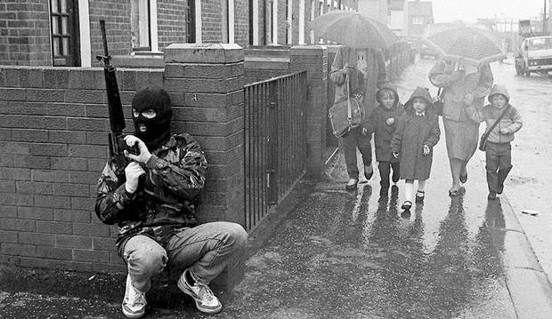
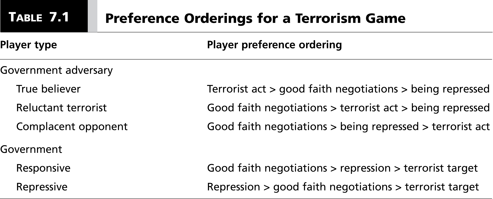
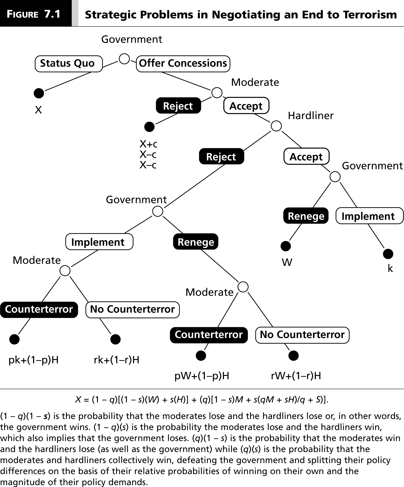

# Introduction
### Goal for Today

*Discuss the rationality of terrorism.*

### Is Terrorism Rational?

### A Definition of Terrorism

We define **terrorism** as:

- premeditated use of violence by individuals or subnational groups to...
- intimidiate a "larger audience" beyond the immediate victims to...
- obtain some objective that is political or social in nature.

Terrorism scholars split hairs further about the perpetrator and immediate victim.

- However, the "larger audience" is the same.

# Beliefs about Terrorism
### Aren't Terrorists "Crazy"

Common belief about terrorists: they're crazy radicals.

- Terrorists prefer terrorism because they are cruel.
- Therefore: governments should never negotiate with terrorists.

However, terrorists vary by type.

- Declarations of no-negotiation actually precipitates some terrorist acts.

### Types of Terrorists

## When a Reluctant Terrorist Goes with Terror
### When a Reluctant Terrorist Goes with Terror

Assume for a reluctant terrorist:

- *U*(negotiations) = 1
- *U*(terrorism) = .4
- *U*(government repression) = 0

The reluctant terrorist does *not* know the government type. Assume:

- *p*(responsive) = .5
- *p*(repressive) = .5

What's the expected utility for the "terrorist" to negotiate?

### When a Reluctant Terrorist Goes with Terror

\begin{eqnarray}
EU_{negotiations}  &=& p*U_{(negotiations)} + (1 - p)*U_{(repression)}    \nonumber \\
EU_{negotiations} &=& (.50)(1) + (.50)(0) \nonumber \\
EU_{negotiations} &=& .5 \nonumber
\end{eqnarray}

Where $EU_{terrorism}$ = .4, the reluctant terrorist prefers to negotiate.

### When a Reluctant Terrorist Goes with Terror

Assume *p*(repressive) = .65. Then:

\begin{eqnarray}
EU_{negotiations}  &=& p*U_{(negotiations)} + (1 - p)*U_{(repression)}    \nonumber \\
EU_{negotiations} &=& (.35)(1) + (.65)(0) \nonumber \\
EU_{negotiations} &=& .35 \nonumber
\end{eqnarray}

Under these conditions, reluctant terrorists commit terror acts despite a preference for negotiation.

### When a Reluctant Terrorist Goes with Terror

When a government declares that it will not negotiate with terrorists, reluctant terrorists believe the probability that the government is repressive increases.

- The more credible the government statement is in the eyes of reluctant terrorists, the more strongly they will believe that the government is repressive.

## What Do No-Negotiation Declarations Mean for Terrorist Beliefs?
### What Do No-Negotiation Declarations Mean for Terrorist Beliefs?

We can use the Bayes’s rule to see how reluctant terrorists incorporate new information and update their beliefs about the type of government they face based on what the government says or does.

### Bayes Rule

With only two possible outcomes (*B* and ~*B*).

$$
	p(B \thinspace  | \thinspace  A) = \frac{p(A \thinspace | \thinspace B)p(B)}{p(A \thinspace  | \thinspace B)p(B) + p(A \thinspace |\sim B)p(\sim B)}
$$

\medskip

Check my lectures on my POSC 3410 if you want more information.

- "Probability and Counting for Political Science"
- "Bayesian Inference for Comparative Research"

### A Reworked Theorem

Let:

- *S* = statement against negotiation
- *R* = government is repressive type
- *~R* = government is not repressive type (i.e. is responsive)

Then:

$$
	p(R \thinspace  | \thinspace  S) = \frac{p(S \thinspace | \thinspace R)p(R)}{p(S \thinspace  | \thinspace R)p(R) + p(S \thinspace |\sim R)p(\sim R)}
$$

### A Reworked Theorem

Assume:

- *p*(S | R) = 1
- *P*(S | ~ R) = .5
- *p*(R) = .5

Then: 

\begin{eqnarray}
p(R \thinspace  | \thinspace  S)  &=& \frac{p(S \thinspace | \thinspace R)p(R)}{p(S \thinspace  | \thinspace R)p(R) + p(S \thinspace |\sim R)p(\sim R)}   \nonumber \\
p(R \thinspace  | \thinspace  S) &=& \frac{(1)(.50)}{(1)(.50) + (.50)(.50)} \nonumber \\
p(R \thinspace  | \thinspace  S) &=& \frac{.5}{.75} \nonumber \\
p(R \thinspace  | \thinspace  S) &=& .67 \nonumber
\end{eqnarray}

### Implications of Bayes Theorem

Statements of no-negotiation *increase* the reluctant terrorist's probability (i.e. **posterior probability**) that the government is repressive.

- In our example, reluctant terrorists negotiate when *p* = .50.
- A statement of no-negotiation makes terrorism a more attractive strategy.

### General Implications

We observe a reinforced cycle of beliefs.

- The more reluctant terrorists believe the government is repressive, the more likely they conduct terrorist acts.
- The more terrorist acts, the more likely the government believes the reluctant terrorist is a true believer.

*Perceptions matter.*

- The choices they make are rational, but ex post suboptimal.

# Credible Commitments, Strategic Dilemmas, and Terrorism
## A Three-Player Terrorism Game
### Credible Commitments, Strategic Dilemmas, and Terrorism

Assume a simple game with three players.

- The government (*G*)
- A moderate terrorist group 
- A hard-line terrorist group

Students may balk at the idea of a "moderate" terrorist group, but that would belie observations across the world and what we've said to this point in the lecture.

### Preference Orderings

The government prefers all-out victory (*W*) to conceding to moderates' demands (*M*).

- It also prefers *M* to a victory by hard-line terrorists (*H*)
- As such: *W* > *M* > *H*

Terrorist preference orderings:

- Moderates: *M* > *H* > *W*
- Hard-liners: *H* > *M* > *W*

Let *X* be thee utility of the status quo, which we assume is a backdrop of terror.

### More Assumptions

If *G* offers a deal to the moderates that is rejected:

- *G* gets a payout equal to *X* + *c*
- Both terror groups get *X* - *c*
- i.e. terrorists pay a political price for rejecting negotiations.

If *G* and the moderates agree to a deal:

- *G* promises concessions worth *k* to the moderates.
- Moderates agree to disarm and provide counterterror assistance against the hard-liners.

### More Assumptions

With counterterrorism, the probability that *G* defeats hard-liners = *p*.

- Without it, *p*(*G* defeats hard-liners) = *r*
- Note: *p* > *r*.

### A Representation of the Game

### Preference Orderings for this Game

- For *G*: *W* > *X* + *c* > *X* > *M* > *H*
- For moderates: *M* > *H* > *X* > *X* - *c* > *W*
- For hard-liners: *H* > *M* > *X* > *X* - *c* > *W*

## When Do Governments and Moderate Terrorists Negotiate?
### Counterterrorism and Optimal Concessions

Assume: 

- *G* and moderates agree to a deal.
- Hard-liners reject the deal.
- *G* implements concessions worth *k*.
- Moderates end game with decision to provide (or not) counterterror assistance.

Moderates provide counterterror assistance if:

- *p*(*k*) + (1 - *p*)(*H*) > *r*(*k*) + (1 - *r*)*H*

### Counterterrorism and Optimal Concessions

Let's rearrange this:

\begin{eqnarray}
p(k) + (1 - p)(H)  &>&  r(k) + (1 - r)H   \nonumber \\
pk + H - pH &>& rk + H - rH \nonumber \\
pk - rk &>& H - H + pH - rH \nonumber \\
k(p - r) &>& H(p - r) \nonumber \\
k &>& H \nonumber
\end{eqnarray}

In plain English, what does this say?

### Counterterrorism and Optimal Concessions

However, *G* makes a prior decision to implement or renege.

- *U*(implement) = *p*(*k*) + (1 - *p*)(*H*)
- *U*(renege) = *r*(*W*) + (1 - *r*)(*H*)
- Recall: *p* > *r* and *W* > (1 - *k*).

*G* faces a trade-off:

- better odds of winning but for a smaller gain, or:
- worse odds of winning for a bigger gain.

### Counterterrorism and Optimal Concessions

Let's isolate for *k* again. *G* implements when:

\begin{eqnarray}
p(1 - k) + (1 - p)(H)  &\ge&  r(W) + (1 - r)(H)  \nonumber \\
p - pk + H - pH &\ge& rW + H - rH \nonumber \\
p - pH + rH - rW &\ge& pk\nonumber \\
p(1 - H) + r(H - W) &\ge& pk \nonumber \\
(1 - H) + \frac{r(H - W)}{p} &\ge& k \nonumber
\end{eqnarray}

### Counterterrorism and Optimal Concessions

However, we don't expect moderates to accept a deal unless *G* implements it. Let's solve for *k* again.

\begin{eqnarray}
X - c  &\le&  p(k) + (1 - p)(H) \nonumber \\
X - c - (1 - p)(H) &\le& pk \nonumber \\
\frac{X - c - (1 - p)(H)}{p} &\le& k \nonumber 
\end{eqnarray}

A deal exists when: 

$$
(1 - H) + \frac{r(H - W)}{p} \ge k \ge \frac{X - c - (1 - p)(H)}{p}
$$

## Concessions and Terrorist Violence
### Concessions and Terrorist Violence

A concession exists in which *G* and the moderates agree to a deal, but *H* rejects.

- The concessions *k* results in counterterror help against the hard-liners.

However, does this guarantee a decrease in violence?

### Concessions and Terrorist Violence

*G*'s access to resources increases, but so does *H*'s access to resources.

- Moderates are likely to lose members whose ideal positions are closer to *H* than *k*.
- But, they otherwise preferred *M* to *H*.

*G* improves in its ability to defeat *H*, but *H* gains more support.

- Thus, *H* is more likely to engage in more terrorism.

# Conclusion and Implications
### Conclusion and Implications

Important conclusions about defeating terrorism:

1. Governments have little incentive to implement promises if there's just one terror group.
2. It's not possible to reach a deal with all terrorists.
3. Wiping out terrorism routinely requires support of moderate terror groups.
4. Unless all members of a moderate group are on board with government concessions, hard-line terrorists will see an increase in capabilities.

### Other Implications

There are some other intriguing implications too.

1. Moderate terrorists have an incentive to foster extremists.
2. High-quality counterterrorism increases the probability of all-out victory, but makes it more difficult to negotiate.
3. Moderate terrorists with poor counterterror abilities are unattractive partners.

