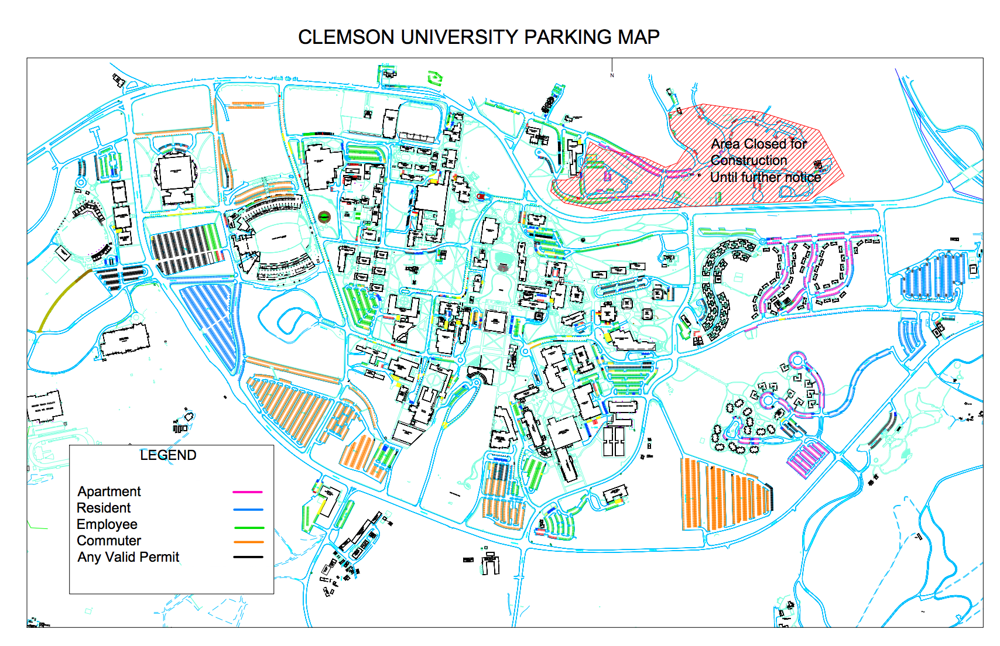
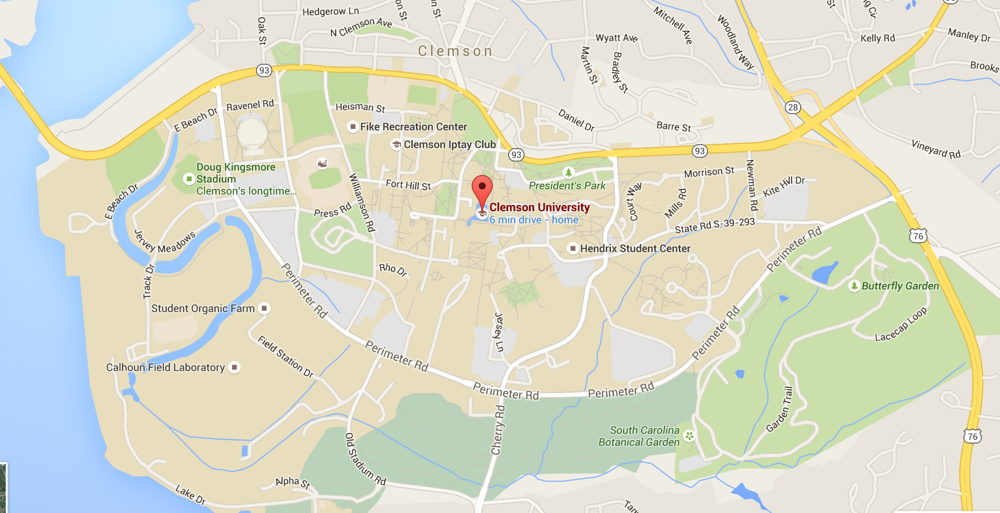

# Introduction
### Goal for Today

1. *Discuss the components of a theory.*
2. *Belabor how to evaluate a theory.*

# What are Theories?
## Theories as Simplications of Reality
### What *Exactly* is a Theory?

A **theory** is an explanation of some empirical phenomena.

- They are not **hypotheses**, which are empirical predictions derived from the theory.
- They are not **facts**.
	- Facts are used to evaluate theories.
	- Facts are also descriptions of reality (i.e. things to be explained).

### What *Exactly* is a Theory?

Theories state expected relationships between antecedent and consequent.

- Antecedent: prior condition. 
	- Also called a **independent variable** or "cause".
- Consequent: resulting condition.
	- Also called a **dependent variable** or "effect".

*Our expectations must be informed by logically connected arguments*.

- Saying "we expect some kind of connection" is not good enough.

### What *Exactly* is a Theory?

Theories generally take on the following forms.

- **Necessary conditions**: if not-A, then not-B.
- **Sufficient conditions**: if A, then B.
- **Necessary and sufficient**: if A, then B *and* if not-A, then not-B.
- **Probabilistic**: e.g. if A, then probably B.

## Constructing Theories
### Constructing Theories

Our theories are supposed to be **deductive**, not inductive.

- **Deductive**: "top-down"
    - Premises are assumed to be true.
    - Observations are deemed consistent/contradictory to theory's predictions.
- **Inductive**: "bottom-up"
    - Observations suggest patterns.
    - Tentative hypotheses suggest bigger theories.
    
### The Problem of Induction

Why not induction? Induction appears to coincide with some inference.

- The sun rises in the east.
- You'll die if you don't drink water.

However, induction coincides with some major inferential problems.

- "Black swan events"
- Need infinite confirming observations.
- The premises may be true but the conclusion may be false.

*Per induction, Newtonian physics (for example) would be as correct as Einstein's theory of relativity*.

- Popper: knowledge is progressed not by confirmation, *but by refutation*.

### Assumptions

Theories require **assumptions**, which are simplifying conditions under which a theory is expected to hold.

- These are the building blocks of theories.
- May assume form of a modus tollens.

The basic sequence: if I accept the assumptions, I must accept the predictions informed by the assumptions.

- Otherwise, I've contradicted myself.

### A Basic Theory

Observe a basic theory in form of a syllogism.

- If I do not get out of bed before 8 a.m. on December 10, I cannot take the final.
- If I do not take the final, I cannot pass this class.
- *Therefore*: if I do not get out of bed, I cannot pass this class.

Accept the assumptions? Then, you must accept the conclusions.

### Some Common Assumptions in IR

Here are some common assumptions in IR scholarship.

- The international system is anarchic. (*Realism*)
- The international system is hierarchic. (*Power transition theory*)
- States are motivated by the pursuit of power. (*Classical realism*)
- States are motivated by the pursuit of *security*. (*Neorealism*)
- States are unitary actors with "national interests" (Structural theories)
- States are organizations with internally competing "bureaucratic interests". (*Bureaucratic politics model*)

Notice: we say *nothing* (for now) of the soundness of these assumptions.

- We assume them to be true and derive predictions from them on empirical phenomena we want to explain.

## Judging Theories
### Judging Theories

So how do we judge theories?

1. Logical consistency
2. Parsimony
3. Usefulness
4. Successful predictions relative to other competing theories.

### Logical Consistency

Bad theories have assumptions that contradict other assumptions.

- This can happen when theories are constructed ad hoc.

Consider Morgenthau's famous theory of international politics.

- All states desire to attain a maximum of power.
- All states must be worried about what other increases in power do to their relative position.
- Therefore, states that have acquired a relative power advantage should revise it permanently in their favor.
- Status quo nations, though, only want to keep what they have.

### What's the Matter with Morgenthau?

Logically inconsistent theories are not falsifiable and are therefore not useful.

- The "status quo" qualifier denies the universality of his claim of power-seeking states.

Behavior is not predicted by this theory.

- Any behavior can be validly deduced from an inconsistent assumption set.

### Parsimony

**Parsimony**, explaining more with fewer set of assumptions, is a virtue in science.

- In IR, for example, neorealism has about five assumptions.
- Democratic peace theory might have two assumptions.
- Selectorate theory may have about five assumptions as well.

With limited assumptions, these theories purport to explain a variety of behaviors in the international system.

### Usefulness

"All models are wrong, but some are useful." -- George E.P. Box.

- Recall: models (i.e. theories) represent simplifications of reality.

Theories/models, like maps, are "purpose-relative".

- Recommended reading for political scientists: Clarke, Kevin A. and David M. Primo. 2012. *A Model Discipline: Political Science and the Logic of Representation*. Oxford University Press.

### A Parking Map of Clemson

### A Street Map of Clemson

### Usefulness

Models are not perfect representations of phenomena, but they can help us understand, explain, and predict them. They can be *useful*.

- Usefulness is not judged by personal taste, but by predictive and explanatory ability.
- We can challenge assumptions if we believe they are **unsound**.

### First Principle of Wing-Walking

Sometimes theories accumulate enough contradictory evidence or incorrect predictions.

- However, we reject them only if the contradictory evidence is large enough, AND
- We can substitute the theory/model with a better one.

The author calls this the **first principle of wing-walking**.

- i.e. do not give up a theory until something better comes along.
- Even Newtonian physics was not taught regularly for 100 years after its development.

Related: do not give up a theory because something newer comes along.

- The SDI ("Star Wars") debate in the 1980s highlights this.

# Conclusion
### Conclusion

A theory is an explanation of some empirical phenomena. It has three key components.

1. Assumptions
2. Logic
3. Predictions

We will belabor three points in this class on how to evaluate a theory.

1. The logical consistency of the theory's assumptions.
2. Evidence that is consistent or contradicts the theory's predictions.
3. Evidence of whether alternative theories outperform a theory in question.

Evaluation fundamentally rests in predictive/explanatory ability, not personal taste.

